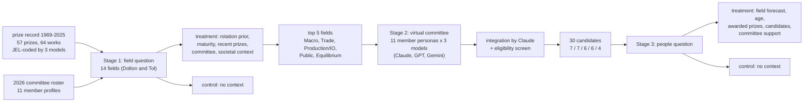
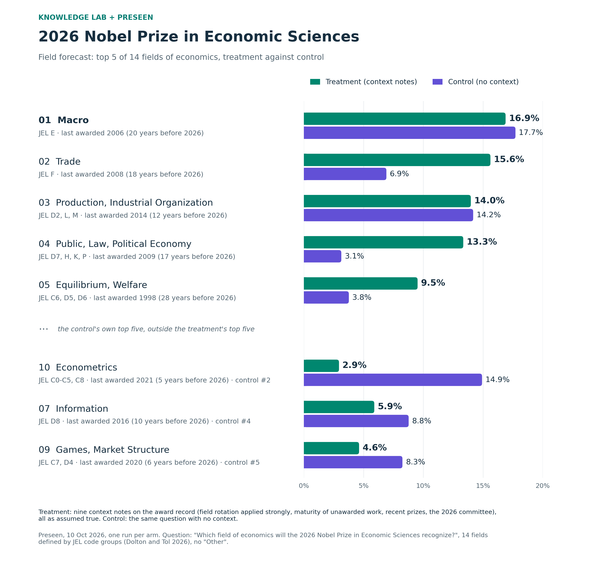
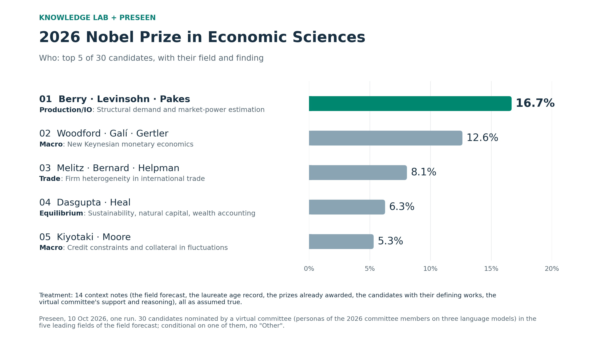

# Forecasting the 2026 Nobel Prize in Economic Sciences: field first, then candidates

> **State on 10 October 2026.** Both forecasts are done; the outcome (announcement on Monday 12 October 2026, 11:45
> CEST) is to be added. Working notes of the build: [`NOTES.md`](NOTES.md).

**Knowledge Lab (University of Chicago) + [Preseen](https://preseen.com).** The economics prize is forecast in two
stages. First, Preseen's AI forecaster predicts **which field of economics** the prize will recognize, among 14 fields
defined by JEL codes. Second, a **virtual committee** — personas of the eleven members of the real 2026 prize
committee, each run on three language models — nominates candidates **in the five fields the field forecast rated most
likely**, with more candidates for the more likely fields. The nominations are integrated into 30 candidate
combinations (a contribution, its one to three people and its defining works), and Preseen forecasts which of them
the prize will recognize. Each Preseen question is run twice: a **control** with no context and a **treatment** with
our context notes.

**Contents** —
[Overview](#overview) ·
[Stage 1: the field](#stage-1-which-field) ·
[Stage 2: candidates](#stage-2-candidates-from-the-five-leading-fields) ·
[Stage 3: the people](#stage-3-who-the-people-forecast) ·
[Factors considered](#factors-considered) ·
[Limitations](#limitations) ·
[Layout](#layout) ·
[References](#references)

---

## Overview

| Stage | Question | Status (10 October 2026) |
|---|---|---|
| 1. Field | "Which field of economics will the 2026 Nobel Prize in Economic Sciences recognize?" (14 options, no Other) | done; treatment top five: Macro 16.9 %, Trade 15.6 %, Production/IO 14.0 %, Public 13.3 %, Equilibrium 9.5 % |
| 2. Candidates | virtual committee in the five leading fields | done; 30 candidates |
| 3. People | "Which contribution will the 2026 Nobel Prize in Economic Sciences be awarded for?" (30 options, no Other) | done; treatment top three: Berry, Levinsohn, Pakes 16.7 %, Woodford, Galí, Gertler 12.6 %, Melitz, Bernard, Helpman 8.1 % |

## Stage 1: which field?

**Options.** The 14 fields of Dolton and Tol (2026, Table B.7), each a group of two-digit JEL codes (codes their table
leaves out were added: C8 to Econometrics, M to Production and IO, O5 to Development). Every prize work of 1969-2025 was
coded in JEL by three language models (claude-opus-5-5, gpt-5.5, gemini-3.1-pro) from its official motivation; their
consensus places each work in one field ([`02_fields/`](02_fields/README.md)). The question resolves by the field of
the primary JEL code of the 2026 motivation, coded the same way.

**Treatment** — nine context notes, all as `assume_true` ([notes](04_field_forecast/context/),
[notebook](04_field_forecast/field_context_prompts.ipynb)):

1. **Field rotation is the primary prior.** Years since each field's last award and the concentration of recent
   awards set the baseline: fields awarded in 2024-2025 take a large penalty, fields awarded in 2021-2023 a penalty,
   fields that have waited long a bonus. This is a deliberate design assumption, not an estimated rule: Dolton and Tol
   find the years since a field's last award significant but not a dummy for the previous year's field.
2. **Maturity of unawarded work.** Whether a field has enough mature, distinct work that has not been recognized.
3. **One classification** for the record and for this year's options; no re-labelling of awarded work.
4. **The 2021-2025 prizes**, with their motivations and fields.
5. **Societal context** (AI and jobs, trade and tariffs, war and migration, inequality, institutions) as auxiliary
   information only.
6. **The 2026 committee**: roster, roles and field coverage from the member profiles, a limited adjustment.
7. **The paper's evidence and its limits**: its coefficients and fit are not probabilities for 2026.

**Results** (Preseen, 10 October; one run per arm; Preseen reports: [treatment](preseen_report/Treatment_field.pdf),
[control](preseen_report/Control_field.pdf); [write-ups](04_field_forecast/results/)):

| Field (years since last award) | Control | Treatment |
|---|---:|---:|
| Macro (20) | 17.7 | **16.9** |
| Trade (18) | 6.9 | **15.6** |
| Production, Industrial Organization (12) | 14.2 | **14.0** |
| Public, Law, Political Economy (17) | 3.1 | **13.3** |
| Equilibrium, Welfare (28) | 3.8 | **9.5** |
| Resources, Environment (8) | 3.4 | 6.5 |
| Information (10) | 8.8 | 5.9 |
| Behavioural, Experimental (9) | 4.7 | 5.7 |
| Games, Market Structure (6) | 8.3 | 4.6 |
| Econometrics (5) | 14.9 | 2.9 |
| Finance (4) | 4.9 | 2.1 |
| Labour (3) | 4.1 | 2.0 |
| Development, Economic History (1) | 2.9 | 0.6 |
| Growth (1) | 2.4 | 0.4 |

- **Macro and Production/IO lead in both arms.** Long waits and mature, recognized programmes (New Keynesian monetary
  economics; empirical industrial organization) point the same way.
- **The treatment follows the rotation prior** (rank correlation 0.94 with the record-only baseline): the fields that
  have waited longest hold 69 % of its probability (46 % in the control), fields awarded in 2021-2023 7 % (24 %). Its own
  maturity judgment lowers Equilibrium from first on the record alone to fifth and raises Production/IO.
- **The control forecasts readiness**: it gives the record a quarter of the weight and builds the rest from mature
  contributions with recent recognition (BBVA, Nemmers, Clarivate), which puts Econometrics second.
- The two arms differ by about 29 percentage points (total variation distance). An earlier run with the formal prize name in
  the title gave nearly the same treatment distribution (2.8 points apart); the control moved more, within its
  run-to-run noise.

## Stage 2: candidates from the five leading fields

**Fields and pool sizes.** The five fields with the highest treatment probability hold 69.3 % of the field forecast.
The 30 candidates are allocated in proportion to their rescaled probabilities: Macro 7 (24.4 %), Trade 7 (22.5 %),
Production/IO 6 (20.2 %), Public 6 (19.2 %), Equilibrium 4 (13.7 %).

**Virtual committee** ([`06_candidates/`](06_candidates/README.md)). Eleven personas, one per member of the real 2026
committee, reconstructed from the members' published research records (each profile merges the descriptions of three
language models, written without web access; [`01_committee/`](01_committee/README.md)). Each persona was asked on
claude-opus-5-5, gpt-5.5 and gemini-3.1-pro — 33 ballots — for up to five ranked nominations in each of the five fields.
A nomination is a contribution in the style of an official motivation, its JEL code, one to three living people with
their years of birth, up to three **defining works** and a rationale of up to three sentences including the main
reservation. The prompt states the rules (at most three living people, no previous laureate, no re-labelling of an
awarded contribution) and the age record of past laureates as context. All 33 ballots were valid: 165 nominations per
field.

**Integration.** Claude (claude-opus-5-5) grouped each field's nominations from the three models into distinct
candidates — one contribution that a single motivation could award to at most three people — and wrote the motivation,
the lineup, the defining works (copied from the nominations) and the committee's reasoning. Support is counted from the
assignment, not judged: a model-balanced Borda score (at most 15), the models and members that nominated each
candidate, and how many nominations name each person. The fields have 18 to 28 candidates each; the pool takes the
leading ones by score.

**Eligibility.** Sitting committee members (Per Krusell, named most often for heterogeneous-agent macroeconomics) and
previous laureates are left out of the lineups. A Wikidata check of every named person, with a manual review of
unclear matches, found two people named by the models who have died — Hugo Sonnenschein (2021) and Jonathan Eaton
(2024); they are left out of the lineups and noted in the context.

**The 30 candidates** ([question](07_people_forecast/questions/people30.json)):

| Field | Candidates (people — contribution) |
|---|---|
| **Macro** (7) | 1. Michael Woodford, Jordi Galí, Mark Gertler — developing the New Keynesian framework of nominal rigidities and welfare-based monetary policy analysis 2. Nobuhiro Kiyotaki, John Moore — showing how credit constraints and collateral amplify and propagate macroeconomic fluctuations 3. Mark Huggett, Anthony A. Smith Jr., Truman Bewley — the development of heterogeneous-agent incomplete-markets macroeconomics and methods for solving it with aggregate shocks 4. John B. Taylor — the formulation and analysis of rules for monetary policy and of staggered contracts 5. Christina D. Romer, David H. Romer, Valerie A. Ramey — the narrative identification of the macroeconomic effects of monetary and fiscal policy 6. Robert E. Hall — the intertemporal analysis of consumption under rational expectations and of labor-market fluctuations 7. Robert J. Barro — the analysis of public debt, Ricardian equivalence and tax smoothing in intertemporal macroeconomics |
| **Trade** (7) | 1. Marc J. Melitz, Andrew B. Bernard, Elhanan Helpman — the analysis of firm heterogeneity, selection and reallocation in international trade 2. Samuel Kortum — developing quantitative Ricardian general-equilibrium models of trade, technology and geography 3. Gene M. Grossman, Elhanan Helpman — the analysis of innovation, growth and the political economy of trade policy 4. Maurice Obstfeld, Kenneth Rogoff — founding the micro-founded intertemporal new open-economy macroeconomics 5. David H. Autor, David Dorn, Gordon H. Hanson — the empirical analysis of the local labor-market effects of import competition 6. Pol Antràs, Gene M. Grossman, Esteban Rossi-Hansberg — the analysis of offshoring, incomplete contracts and the organization of global value chains 7. James E. Anderson, Eric van Wincoop — the theoretical foundation of structural gravity and the measurement of trade costs |
| **Production / IO** (6) | 1. Steven Berry, James Levinsohn, Ariel Pakes — developing structural methods for the empirical analysis of demand and market power in differentiated-product markets 2. Nicholas Bloom, John Van Reenen, Raffaella Sadun — measuring management practices and their effects on productivity across firms and countries 3. John Sutton — the analysis of endogenous sunk costs and the bounds approach to market structure 4. Jean-Charles Rochet, Mark Armstrong, Bruno Jullien — the theory of two-sided markets and platform competition 5. John C. Haltiwanger, Lucia Foster, Chad Syverson — the empirical analysis of productivity dispersion, firm dynamics and reallocation using microdata 6. Timothy F. Bresnahan, Peter C. Reiss — the empirical analysis of entry and competition in concentrated markets |
| **Public, law, political economy** (6) | 1. Torsten Persson, Guido Tabellini — the analysis of how political institutions and constitutions shape economic and fiscal policy 2. Emmanuel Saez, Raj Chetty, Henrik Kleven — linking optimal tax and social insurance theory to empirically estimable sufficient statistics 3. Steven Shavell, Richard A. Posner, Guido Calabresi — the economic analysis of law, liability and enforcement 4. Emmanuel Saez, Thomas Piketty, Gabriel Zucman — the measurement of top incomes and wealth from tax records and its integration into the theory of optimal taxation 5. Andrei Shleifer, Rafael La Porta, Florencio Lopez-de-Silanes — showing how legal origins and investor protection shape financial and economic development 6. Amy Finkelstein, Jonathan Gruber, Raj Chetty — the empirical analysis of health insurance and social insurance design |
| **Equilibrium, welfare** (4) | 1. Andreu Mas-Colell, Yves Balasko — the analysis of the structure, regularity and limits of general equilibrium theory 2. John E. Roemer, Marc Fleurbaey, François Maniquet — the theory of equality of opportunity, responsibility and fairness in welfare economics 3. John Geanakoplos, Herakles Polemarchakis, Michael Magill — the theory of general equilibrium with incomplete markets and its constrained inefficiency 4. Partha Dasgupta, Geoffrey Heal — the welfare economics of sustainability, natural capital and intergenerational wealth accounting |

## Stage 3: who? (the people forecast)

**Question.** "Which contribution will the 2026 Nobel Prize in Economic Sciences be awarded for?" — the 30 candidates,
no "Other": the forecast is conditional on the prize going to one of them and the question is annulled otherwise.
Options are matched by contribution; the people named need not match the laureates exactly.

**Treatment** — fourteen context notes as `assume_true` ([notes](07_people_forecast/context/),
[notebook](07_people_forecast/people_candidate_prompts.ipynb)): an instruction; the field forecast (treatment arm of
stage 1); age and timing; the prizes already awarded; per field, the candidate combinations with the people's years of
birth and their defining works; per field, the virtual committee's support and reasoning. **Control**: no notes.

**Results** (Preseen, 10 October 2026, 15:03-15:37 CDT; one run per arm; Preseen reports:
[treatment](preseen_report/Treatment_candidate.pdf), [control](preseen_report/Control_candidate.pdf);
[forecast table](../Data/Result/Economics/nobel_economics_2026_people.csv),
[write-ups](07_people_forecast/results/)):

With the control's probability beside each candidate: [figure](../docs/nobel2026/economics_2026_people_top5.png).

| Treatment rank | Candidate | Treatment | Control (rank) |
|---:|---|---:|---:|
| 1 | Berry, Levinsohn, Pakes — structural demand and market-power estimation (Production/IO) | **16.7** | 17.6 (1) |
| 2 | Woodford, Galí, Gertler — New Keynesian monetary economics (Macro) | **12.6** | 17.3 (2) |
| 3 | Melitz, Bernard, Helpman — firm heterogeneity in international trade (Trade) | **8.1** | 8.7 (3) |
| 4 | Dasgupta, Heal — sustainability and natural capital (Equilibrium) | **6.3** | 4.5 (6) |
| 5 | Kiyotaki, Moore — credit constraints and collateral (Macro) | **5.3** | 5.0 (5) |
| 6 | Obstfeld, Rogoff — new open-economy macroeconomics (Trade) | 3.9 | 5.0 (4) |

- **The arms agree on the leaders** (rank correlation 0.66; 11.5 percentage points apart, against about 29 at the field
  stage): both put the empirical IO of Berry, Levinsohn and Pakes first, New Keynesian economics second and
  heterogeneous-firm trade third, and both cite the same recognitions (Clarivate, BBVA, Nemmers).
- **The treatment kept the field forecast as its prior** and moved two fields: Production/IO up from 20.2 % to 25.8 %
  (BLP's mature, clearly attributed method) and Public down from 19.2 % to 12.8 % (constitutions and legal origins sit
  close to the 2024 institutions prize). It also spreads probability further into each field's list (Equilibrium 13.2 %
  against 7.9 % in the control).
- **The control set its own field weights** (Macro 32 %), which lifts New Keynesian economics to 17.3 % and the macro
  classics (Taylor, Barro, Hall) above their treatment ranks.
- Both arms noted Jonathan Eaton's death and kept Samuel Kortum eligible for their joint contribution; both noted that
  options are matched by contribution, so a prize to Blanchard, Galí and Woodford would resolve to the New Keynesian
  option.

## Factors considered

| Factor | Where it enters | How |
|---|---|---|
| Field rotation | stage 1 treatment | primary prior: years since the field's last award, recent concentration, penalty and bonus tiers |
| Maturity of unawarded work | stage 1 treatment; stage 3 (defining works) | is there distinct, mature, unrecognized work in the field and for the candidate? |
| Age and timing | committee prompt; stage 3 note | median age at the award 67 (middle 80 % 57-78); yearly award rate among eventual laureates rising from about 61; Dolton and Tol's peak at 70-71; co-laureates usually one generation apart; never posthumous |
| Overlap with past prizes | stage 1; committee prompt; stage 3 note | awarded contributions are not nominated again; overlap with recent prizes, also across fields, lowers a candidate |
| Committee expertise and views | stage 1 note; stage 2 personas; stage 3 notes | the 2026 roster's field coverage; simulated support and reasoning of member personas |
| Field probability | stage 2 pool sizes; stage 3 note | more candidates for likelier fields; field weights for the people forecast |
| Eligibility | stages 2-3 | living (Wikidata screen), no previous laureate, no sitting committee member |
| Societal context | stage 1 treatment | auxiliary only |
| External signals (prediction markets, Clarivate, other prizes) | not supplied in our notes | Preseen's forecaster searches the web itself and cited Clarivate 2026, BBVA awards and the 2026 Nobel Symposium |

## Limitations

- The committee is a simulation. Its personas are reconstructed from published records by language models without
  web access; the nominations are not the views of the real members, who were not consulted.
- Strong field rotation is a design choice. The control arm, which does not impose it, puts much more weight on
  Econometrics, Information and Games.
- The pool covers the five leading fields only: 69 % of the treatment's field probability, about 46 % of the
  control's. Strong candidates in other fields (for example in econometrics or labour economics) are outside the pool
  by design, and the people question is annulled if the prize goes outside it.
- Years of birth are those stated by the models, and the living check is a screen, not a verification of every
  person. The models nominated two people who have died.
- One run per arm: differences of a few percentage points between runs are within noise.

## Layout

| Folder | Content |
|---|---|
| [`data/`](data/) | prize record 1969-2025 (nobelprize.org list page and Nobel Prize API) |
| [`01_committee/`](01_committee/README.md) | profiles of the 11 members of the 2026 committee (three models, merged by Claude) |
| [`02_fields/`](02_fields/README.md) | JEL coding of the prize works and the field analysis |
| [`04_field_forecast/`](04_field_forecast/README.md) | stage 1: context notes, question, run script and results of the field question |
| [`05_laureates/`](05_laureates/README.md) | age at the award of the 99 laureates |
| [`06_candidates/`](06_candidates/README.md) | stage 2: virtual committee, Claude integration, candidate pool |
| [`07_people_forecast/`](07_people_forecast/README.md) | stage 3: context notes, question, living check, run script |
| [`preseen_report/`](preseen_report/) | the Preseen reports (PDF) of the four runs: field and people questions, treatment and control |
| [`record/`](record/) | detailed record of the work (LaTeX) |

## References

- Peter J. Dolton and Richard S. J. Tol, "The Process and Dynamics of the Nobel Memorial Prize in Economics,
  1969-2025", arXiv:2603.20767v1 (21 March 2026).
- Prize record and motivations: [nobelprize.org](https://www.nobelprize.org/prizes/lists/all-prizes-in-economic-sciences/)
  and the Nobel Prize API 2.1.
- JEL classification: American Economic Association, [JEL codes](https://www.aeaweb.org/econlit/jelCodes.php).
