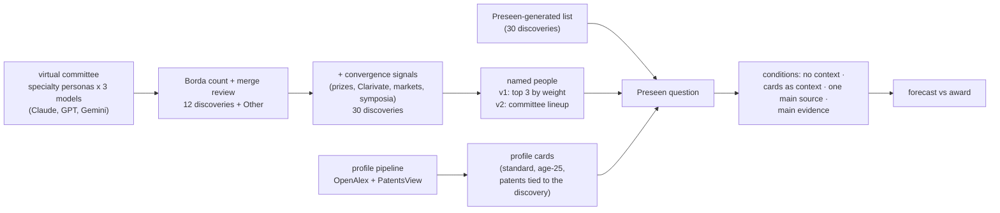

# Forecasting the 2026 Nobel Prizes: a virtual committee, bibliometric profiles and an AI forecaster

**Knowledge Lab (University of Chicago) + [Preseen](https://preseen.com).** A virtual Nobel committee of language-model
personas nominates discoveries; the nominations become multiple-choice questions of 12 or 30 discoveries, each with the
people most likely to share the prize; every named person gets a bibliometric profile card (papers, patents, books,
collaboration, compared with past laureates at the time of their prize); and Preseen's AI forecaster gives
probabilities with and without those cards. This README shows the forecasts for 2026 next to the awards.

**Contents** —
[2026 results](#2026-results) ·
[Medicine](#physiology-or-medicine-awarded-5-october) ·
[Physics](#physics-awarded-6-october) ·
[Chemistry](#chemistry-announced-7-october) ·
[What we learned](#what-we-learned-so-far) ·
[How the forecasts are made](#how-the-forecasts-are-made) ·
[Experiments](#experiments) ·
[Profiles of scientists](#the-data-engine-research-profiles-of-scientists) ·
[Repository layout](#repository-layout) ·
[Sources](#sources-and-licences)

---

## 2026 results

Probabilities are conditional on the prize going to one of the listed options (the 30-option questions have no
"Other"); an option is matched by its discovery, so the named people need not be the laureates, except in the Medicine
question of 4 October, whose outcomes are exact laureate sets. Forecast data: [`Data/Result/`](Data/Result/); figures:
[`docs/nobel2026/make_figures.py`](docs/nobel2026/make_figures.py).

### Physiology or Medicine (awarded 5 October)


**Award:** Karl Deisseroth, Peter Hegemann and Georg Nagel, "for their discoveries concerning light-gated ion channels
and optogenetics".

- **Final forecast** (Preseen, 4 October; 30 laureate sets): GLP-1 led with 24.7 %. Optogenetics appeared as three
  lineups — Deisseroth · Hegemann · Miesenböck (6th, 4.1 %), Deisseroth · Hegemann · Boyden (7th, 3.6 %), Hegemann ·
  Bamberg · Deisseroth (23rd, 0.9 %) — 8.6 % together; the awarded trio with Nagel was not among the 30 outcomes. In the
  virtual committee only one of the optogenetics nominations (7 % of the option's points) named exactly Deisseroth,
  Hegemann and Nagel.
- **Context conditions** (1–2 October; the same question of 12 discoveries + "Other"):

  | Condition | Runs | Optogenetics | Rank among 12 | Leading option | "Other" |
  |---|---:|---:|---:|---|---:|
  | No context (control) | 5 | 5.5 % | 6 | GLP-1, 20.3 % | 31 % |
  | Profile cards as context | 3 | 6.8 % | 3 | GLP-1, 19.6 % | 30 % |
  | Cards as one of the main sources | 1 | 7.4 % | 4 | orexin, 11.7 % | 34 % |
  | **Cards as the main evidence** | 1 | **7.9 %** | **1** | **optogenetics**, 7.9 % | 40 % |

  The more weight the forecaster gave to the profile cards, the higher the awarded discovery ranked: first under the
  main-evidence instruction, sixth without context, where the award favourite GLP-1 led.

**How each Medicine forecast was set up** (each condition is its own Preseen question with an identical definition;
notes are context the forecaster receives before it runs):

| Forecast | Question | Context given to the forecaster | What changed from the row above |
|---|---|---|---|
| No context (control), 1–2 Oct | 12 committee discoveries + "Other", each naming up to 3 people; resolved by the discovery in the official motivation | none | baseline |
| Cards as context, 1 Oct | same | a definitions note + 30 profile cards, one per named person (treatment `consider`); no instruction | the cards are added, nothing says how to use them |
| Cards as one of the main sources, 2 Oct | same | the same cards + an instruction note (`assume_true`): the profiles are one of the main sources, with weight comparable to the other evidence; use prizes, news, published predictions, the history of the prize and knowledge of the field actively; take the figures as given | the forecaster is told to weigh the cards as much as its other evidence ([note](experiment/preseen_cards_balanced/instruction/00_instruction.md)) |
| Cards as the main evidence (arm 4), 2 Oct, 09:04–09:31 CDT | same | an instruction note (`assume_true`): the profiles are the main evidence for comparing the named options; judge "Other" as usual and use the profiles mainly to divide the remaining probability among the named options; base the relative probabilities primarily on the measures and reference lines; take the figures as given; other information (prizes, news, predictions, history) only as a secondary adjustment; name the profile evidence behind each leading option. Plus the definitions note and the 30 cards (`consider`) | the cards become the basis of the ranking ([note](experiment/preseen_cards_main/instruction/00_instruction.md)); result: "Other" 40 %, optogenetics 7.9 % (first named option), GLP-1 3.0 % |
| Final forecast, 4 Oct ("Treatment Final", the figure above) | a different question: 30 exact laureate sets with their discovery (GLP-1 named as Drucker · Holst · Mojsov), no "Other"; also a version with "Other" (48.1 %) | not recorded in this repository | not the arm-4 run of 2 October, whose GLP-1 option named Mojsov · Holst · Knudsen |

### Physics (awarded 6 October)


**Award:** Francis Halzen alone, "for decisive contributions to the IceCube Neutrino Observatory and the discovery of
high-energy neutrinos of astrophysical origin".

- **Final forecast** (Preseen, 5 October; 30 discoveries, cards as the main evidence): ultracold-atom quantum
  simulation led with 8.7 %; neutrino astronomy was 14th with 3.5 %.
- **All conditions**:

  | Question | Condition | Runs | Neutrino astronomy | Rank | Leading option |
  |---|---|---:|---:|---:|---|
  | 12 + Other (1–2 Oct) | no context (control) | 5 | 3.7 % | 9 of 12 | optical lattice clocks, 14.7 % |
  | | cards as context | 3 | 4.1 % | 9 | optical lattice clocks, 15.4 % |
  | | cards as one of the main sources | 1 | 3.0 % | 9 | quantum simulation, 12.8 % |
  | | cards as the main evidence | 1 | 2.1 % | 11 | quantum simulation, 13.3 % |
  | 30 discoveries (5 Oct) | no context | 1 | 3.1 % | 11 of 30 | optical lattice clocks, 13.7 % |
  | | cards as the main evidence | 1 | 3.5 % | 14 | quantum simulation, 8.7 % |

  The forecasters discounted neutrino astronomy for collaboration-scale attribution (IceCube papers are signed by
  hundreds) and for the earlier neutrino prizes of 2002 and 2015. The committee answered the attribution question by
  giving the prize to one person.
- **Lineup.** The option named Halzen, Karle and Kurahashi Neilson, but two of the four committee nominations of this
  discovery had named Halzen alone: the aggregation filled three places with every name any nomination gave. The
  [v2 lineup rule](experiment/convergence_2026_v2/README.md) (the committee lineup with the highest mean score) shows
  Halzen alone.

**How each Physics forecast was set up:**

| Forecast | Question | Context given to the forecaster | What changed from the row above |
|---|---|---|---|
| 12 + Other, four conditions, 1–2 Oct | 12 committee discoveries + "Other" | as in Medicine: none; 34 profile cards + definitions; + the "one of the main sources" note; + the "main evidence" note | as in Medicine |
| 30 discoveries, no context, 5 Oct | 30 discoveries: the committee's options plus discoveries backed by recent prizes, Clarivate citation laureates, prediction markets and Nobel symposia; **no "Other"**: the forecast is conditional on a listed discovery (annulled otherwise), and when two options match, the most specific one counts | none | a longer list, and probability is spread over named discoveries only |
| 30 discoveries, cards as the main evidence, 5 Oct (final forecast) | same | four notes (`assume_true`): **(1)** a revised main-evidence instruction ([note](experiment/preseen_30_main_v2/instruction/00_1_instruction.md)): judge each option by its named people and state the rule that combines them; career impact and discovery-relevant works are primary, textbook reach supporting, technological translation and collaboration minor; down-weight only for visible attribution anomalies, fewer than about 50 works, or works after 2018; apply the timing prior once; use the Medicine outcome only for calibration; other information may change an option by a factor of 0.5–2, each factor listed; no uniform floor; report the profiles-only and the adjusted distribution. **(2)** definitions of the age-25 cards. **(3)** the timing base rate of the 2000–2025 Physics prizes (lags from the decisive paper to the prize). **(4)** the Medicine 2026 outcome (announced the day before). Plus 30 option blocks (`consider`): an option summary line, the anchor works with their maturity line, an attribution-confidence line, and the age-25 profile of each named person | age-25 cards grouped by option, explicit weighting rules, a timing base rate and this year's Medicine outcome |

Earlier on 5 October, two runs tested the steps in between (in `experiment/preseen_main_no_other/` and
`experiment/preseen_30_no_other/`): the 12 discoveries without "Other" under the 2 October main-evidence note, and the
30 discoveries under that note with the standard cards.

### Chemistry (announced 7 October)

Submitted on 6 October (one run each; [comparison](experiment/preseen_chem30_main/results/compare.md)). The question
lists 30 discoveries; v1 and v2 are the same discoveries with different named people, the third list was generated by
Preseen itself.

| List | Condition | Top 3 |
|---|---|---|
| committee + convergence, v1 lineups | cards as the main evidence | proteomics 9.1 %, dye-sensitized solar cells 8.9 %, nanopores 6.5 % |
| committee + convergence, v2 lineups | cards as the main evidence | proteomics 8.7 %, dye-sensitized solar cells 8.5 %, nanopores 7.9 % |
| committee + convergence, v2 lineups | no context | sequencing-by-synthesis 17.3 %, perovskite solar cells 7.9 %, controlled radical polymerization 6.2 % |
| generated by Preseen | cards as the main evidence | flexible electronics / e-skin 7.7 %, synthetic gene circuits 7.3 %, heterogeneous-catalysis theory 7.1 % |

The scores against the award will be added here after the announcement.

## What we learned so far

- **The context changes the forecast far more than the names on an option.** On the same 30 chemistry discoveries the
  main-evidence instruction and the control agree on the ranking with a rank correlation of 0.14; v1 and v2 lineups
  under the same instruction agree at 0.95.
- **Profile cards favour academically cited careers.** Under "cards as the main evidence" the forecaster ranks options
  by the career impact of the named people. That helped optogenetics (first in Medicine), but it pushes down
  inventions whose evidence sits in patents rather than papers: sequencing-by-synthesis fell from 17.3 % without context
  to 2.4 % (its inventors' citation impact is near the laureate median; their technology impact, at the 92nd–97th
  percentile of laureates, was treated as minor). The chemistry cards now list the patents tied to each discovery.
- **Name the people the evidence supports, not three by default.** Physics went to one person; the committee had said
  so in half of its nominations.
- **No final forecast had the award as favourite.** The awarded discoveries were 6th (Medicine, 30 laureate sets) and
  14th (Physics, 30 discoveries) in the final forecasts.

## How the forecasts are made



- **Committee** ([`experiment/preseen/`](experiment/preseen/README.md)): personas with the specialties of the 2026
  committees, each run on `claude-opus-5-5`, `gpt-5.5-2026-04-23` and `gemini-3.1-pro-preview`; a model-balanced Borda
  count and a recorded merge review give the candidate discoveries.
- **30-option lists** ([`experiment/convergence_2026/`](experiment/convergence_2026/README.md),
  [`experiment/convergence_2026_v2/`](experiment/convergence_2026_v2/README.md)): the committee options plus evidence
  from recent prizes, Clarivate citation laureates, prediction markets and Nobel symposia, as extra voters.
- **Profile cards**: one card per named person from the [profile pipeline](docs/author_profiles.md), each measure
  compared with the field's 2000–2025 laureates at the time of their prize. The age-25 cards count only works and
  patents from age 25 on (merged author records often carry a namesake's early papers) and choose the three works most
  tied to the discovery.
- **Conditions**: the same question on Preseen with no context, with the cards as context, with an instruction to use
  them as one of the main sources, or as the main evidence (with the year's earlier outcomes and a timing base rate as
  reference notes).

## Experiments

| Folder | Date | What |
|---|---|---|
| [`experiment/preseen/`](experiment/preseen/README.md) | 1 Oct | committee, 12 + Other per field; control vs cards as context (4 + 3 runs per field) |
| [`experiment/preseen_cards_main/`](experiment/preseen_cards_main/) | 2 Oct | cards as the main evidence; combined page of the four conditions: https://dawoon-jeong0523.github.io/Author_profile/ |
| [`experiment/preseen_cards_balanced/`](experiment/preseen_cards_balanced/) | 2 Oct | cards as one of the main sources |
| [`experiment/convergence_2026/`](experiment/convergence_2026/README.md) | 5 Oct | 30-option lists (physics, chemistry), cards, age-25 physics cards |
| `experiment/preseen_main_no_other/`, `preseen_30_no_other/`, `preseen_12_main_v2/`, `preseen_30_main_v2/`, `preseen_5_main_v2/` | 5 Oct | physics: 12, 30 and 5 options without "Other", main evidence and control |
| [`experiment/convergence_2026_v2/`](experiment/convergence_2026_v2/README.md) | 6 Oct | v2 lineup rule, medicine list, v1/v2 comparison, cards for every list, age-25 chemistry cards |
| [`experiment/preseen_generated30/`](experiment/preseen_generated30/README.md) | 6 Oct | 30 chemistry options generated by Preseen |
| `experiment/preseen_chem30_main/` | 6 Oct | chemistry: main evidence on three lists, control on v2 ([LOG](experiment/preseen_chem30_main/LOG.md)) |
| [`Data/Result/`](Data/Result/) | 4–5 Oct | final medicine and physics forecasts (CSV) and the figure notebook |
| [`handoff/`](handoff/README.md) | 3 Oct | context and forecasts of the four conditions, kept apart, for Preseen |

## The data engine: research profiles of scientists

Every card comes from a profile pipeline that turns a name into a dashboard and an agent-readable record of a career:
every paper and patent scored against its cohort (citations, disruption, Foundation / Extension / Generalization,
citations from books), patent → paper citations, and the co-authorship, co-invention, institution and assignee
networks, from the OpenAlex 2026-01 snapshot, PatentsView 2025-12-31, Reliance on Science and the *Science of Science*
metric pipelines. It works for anybody with an OpenAlex author profile and has profiled all 656 OpenAlex ids of the
physics, chemistry and medicine laureates of 1901–2025.

```bash
python pipeline/profile_person.py "Geoffrey Hinton" --wait
# dashboard: output/dashboard/2024_Physics_Geoffrey-Hinton_A5108093963.html
# record:    output/record/2024_Physics_Geoffrey-Hinton_A5108093963.md
```

Full documentation — example, quick start, name resolution, inventor linking, outputs, measures, configuration, batch
runs, data inputs and caveats: **[`docs/author_profiles.md`](docs/author_profiles.md)**.

## Repository layout

```
Nobel Prize/
├── README.md                         this page (Nobel forecasts)
├── docs/
│   ├── nobel2026/                    README figures and make_figures.py
│   ├── author_profiles.md            documentation of the profile pipeline
│   └── example/hinton/               figures of the profile example
├── Data/
│   ├── Result/                       final 2026 forecasts (medicine, physics) and the figure notebook
│   ├── convergence_2026.csv          person-level evidence for the 30-option lists
│   ├── prizeatlas/                   PrizeAtlas laureate tables (CSV; SOURCE.md)
│   ├── Li2019/, SciSciNet_Link_NobelLaureates.tsv   laureate publication records
├── experiment/                       committee, candidate lists, cards, Preseen runs (see Experiments)
├── handoff/                          context and forecasts for Preseen
├── manuscript/                       LaTeX write-up of the 1 October experiment
├── pipeline/profile_person.py        name -> author id -> Slurm job -> dashboard + record
├── notebook/                         author_profile.ipynb, nobel_laureate_papers.ipynb, prizeatlas_crawl.ipynb, np_common.py
├── jobs/                             Slurm runners
└── requirements.txt
```

Not versioned (`.gitignore`): `output/` (dashboards, records, per-person folders), `cache/` (shared parquet caches),
`jobs/logs/`, `Data/prizeatlas/html/`, every `*.parquet` file, Preseen client state (`experiment/**/preseen_exp/`) and
run logs.

## Sources and licences

OpenAlex (CC0), PatentsView (CC BY 4.0), Reliance on Science (Marx & Fuegi; CC BY 4.0), SciSciNet laureate links,
Li, Yin, Fortunato & Wang (2019) *A dataset of publication records for Nobel laureates*, Scientific Data 6:33
(Harvard Dataverse doi:10.7910/DVN/6NJ5RN), PrizeAtlas (CC BY-SA 4.0, https://prizeatlas.org). Data tables derived from
PrizeAtlas keep its CC BY-SA licence (`Data/prizeatlas/SOURCE.md`). Forecasts: Preseen (https://preseen.com).
