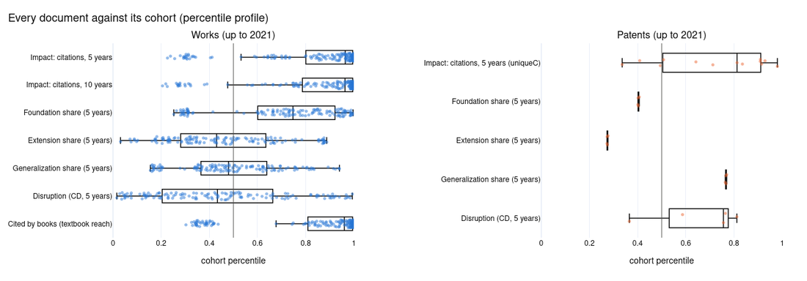
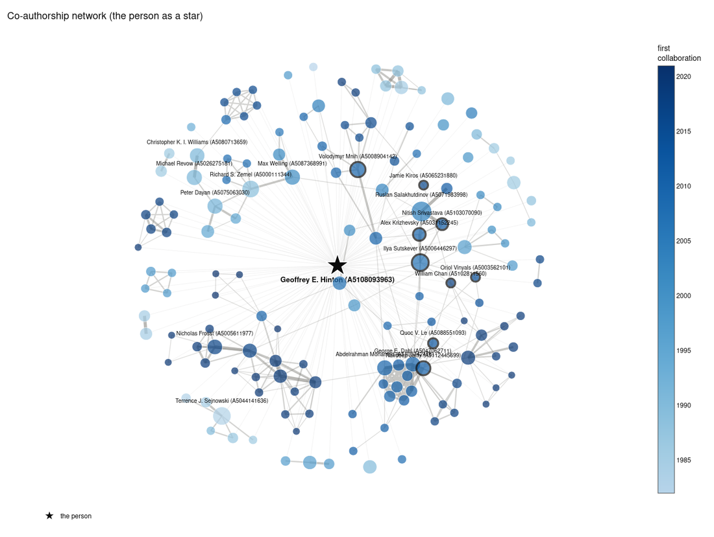
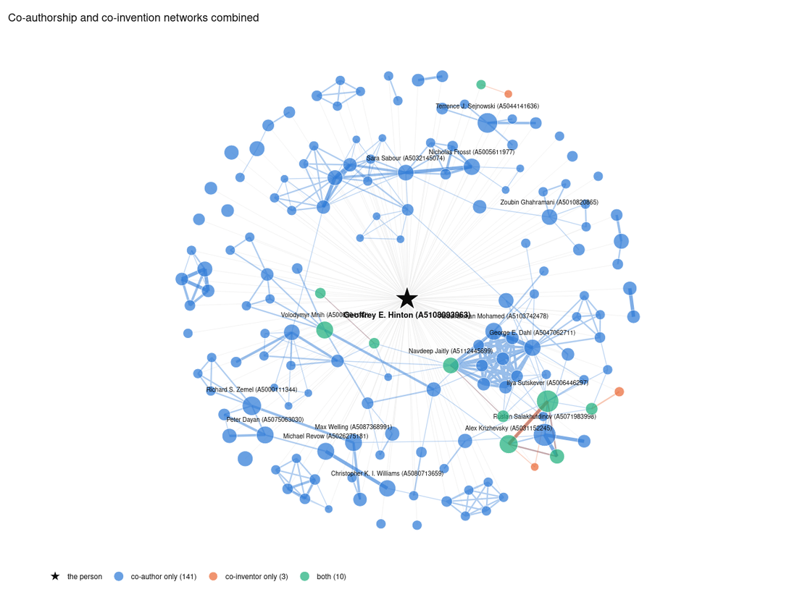
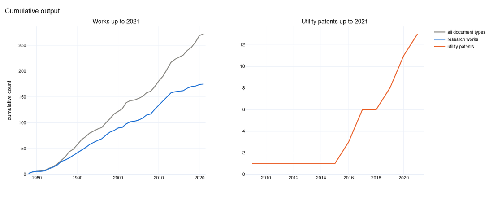
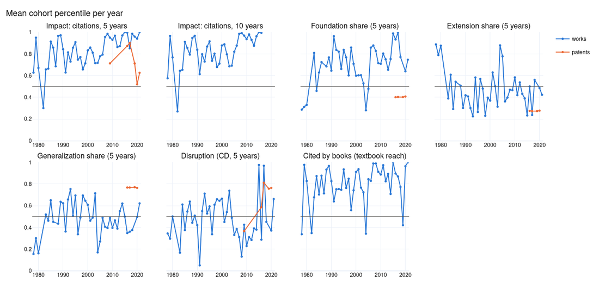
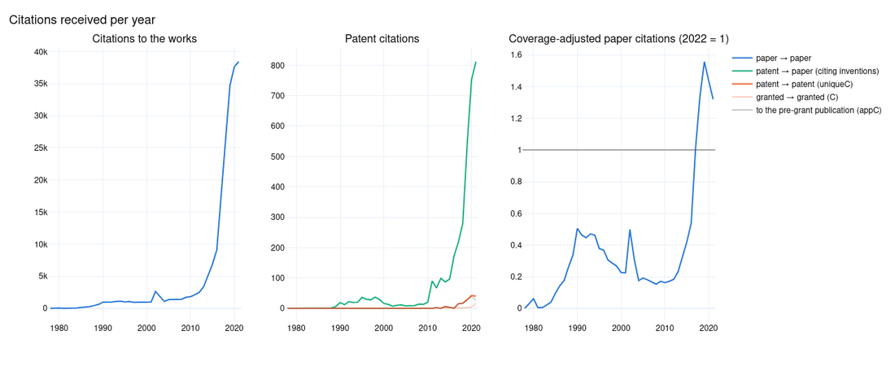
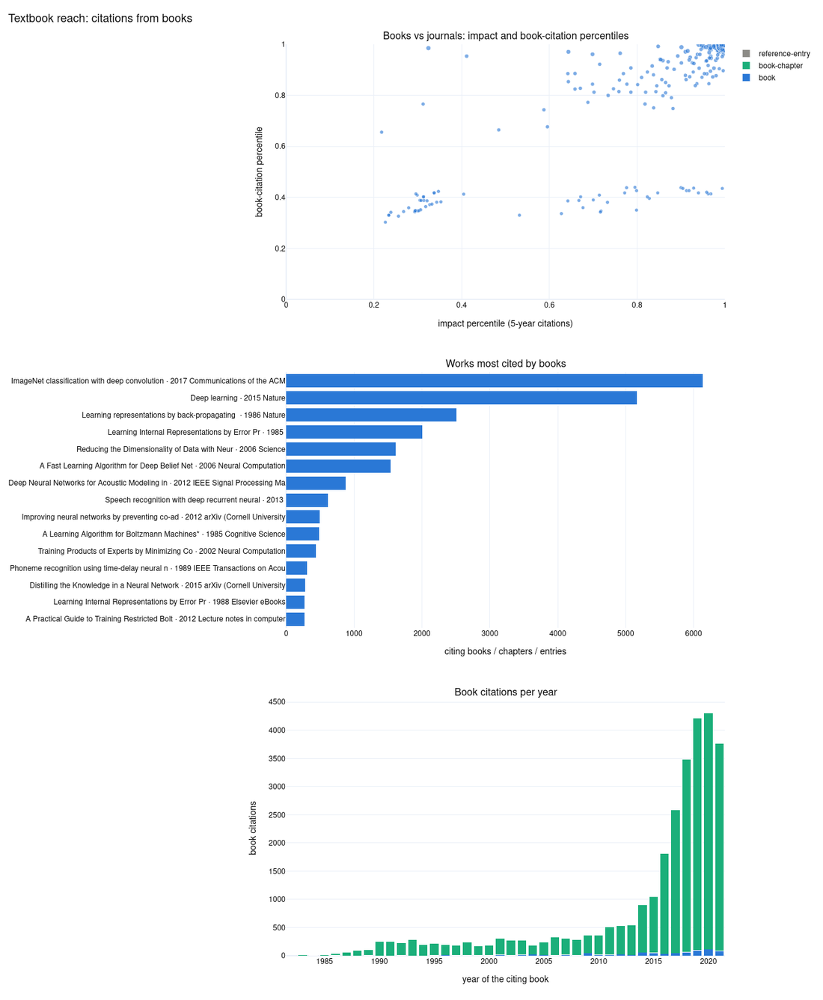
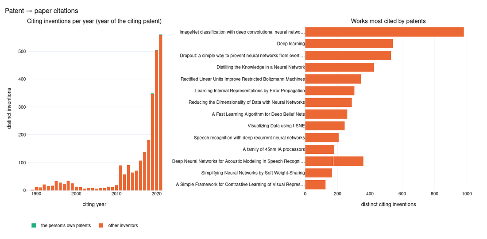
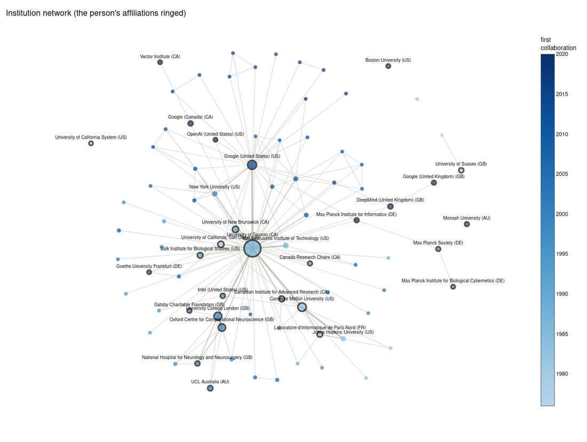
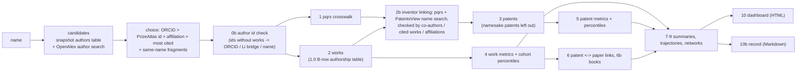

# Research profiles of scientists: papers, patents, books and collaboration

Type a scientist's name, get a **dashboard** and an **agent-readable record** of their career: every paper and patent
scored against its cohort (citations, disruption, Foundation / Extension / Generalization, citations from books),
patent → paper citations, and the co-authorship, co-invention, institution and assignee networks — built from the
OpenAlex 2026-01 snapshot, PatentsView 2025-12-31, Reliance on Science and the *Science of Science* metric pipelines.

The repository started from Nobel laureates (it profiles all 656 OpenAlex ids of the PrizeAtlas laureates in
physics, chemistry and medicine, 1901–2025, and aggregates the SciSciNet laureate papers by field and decade), but
the name pipeline works for **anybody with an OpenAlex author profile**.

```bash
python pipeline/profile_person.py "Geoffrey Hinton" --wait
# Nobel laureate: Geoffrey Hinton, Physics 2024 (PrizeAtlas)
# query 'Geoffrey Hinton': picked A5108093963 Geoffrey E. Hinton [PrizeAtlas OpenAlex id of the laureate]; same-name fragments A5110248343
# submitted Slurm job 59836554 for ['A5108093963', 'A5110248343']
# dashboard: output/dashboard/2024_Physics_Geoffrey-Hinton_A5108093963.html
# record:    output/record/2024_Physics_Geoffrey-Hinton_A5108093963.md
```

**Contents** —
[Example](#example-geoffrey-hinton) ·
[Quick start](#quick-start) ·
[How it works](#how-it-works) ·
[Inventor linking](#inventor-linking) ·
[Name resolution](#name-resolution) ·
[Outputs](#outputs) ·
[Measures](#measures-and-conventions) ·
[Configuration](#configuration) ·
[Batch runs](#batch-runs-nobel-laureates) ·
[Experiment: profiles as forecasting context](#experiment-profiles-as-context-for-an-ai-forecast-of-the-2026-nobel-prizes) ·
[Repository layout](#repository-layout) ·
[Data inputs](#data-inputs) ·
[Caveats](#caveats-and-known-limitations) ·
[Sources](#sources-and-licences)

---

## Example: Geoffrey Hinton

`python pipeline/profile_person.py "Geoffrey Hinton" --wait` resolves the name to the OpenAlex author
`A5108093963` (the laureate's PrizeAtlas id, plus a 36-work fragment `A5110248343` of the same person), finds his PatentsView inventor id by name
search (the pqrs crosswalk points to an OpenAlex id that now belongs to someone else), and writes the dashboard and
the record below. Works published and patents granted up to 2021.

| | |
|---|---|
| Works analysed | **175** research works (416 in the whole OpenAlex record) |
| Patents | **13** US utility patents granted up to 2021 (28 in the record) |
| Impact | median 5-year citation percentile **0.96**; **34 %** of the works in the top 1 % of their year × field |
| Textbook reach | **208** works cited by books, 168 of them by at least 3; 25,117 citing books |
| Patent → paper citations | **5,192** distinct inventions cite the works (11 of them his own) |
| Collaboration | 245 co-authors, 13 co-inventors, **10** people on both sides |

The figures below are captures of the interactive (plotly) figures the notebook writes for the dashboard; the same
figures are saved as `output/<author id>/figures/*.png` and `output/<author id>/html/*.html`.

**Every document against its cohort** — one dot per work or patent: its percentile among the documents of the same
year and field (works) or grant year and CPC section (patents); boxes show the interquartile range:



**Co-authorship network** — the person as a star among the co-authors (labelled `name (OpenAlex id)`, colour = year
of the first collaboration, black rim = also a co-inventor):



**Co-authorship and co-invention combined** — blue edges co-authorship, orange edges co-invention, green people on both sides:



<details>
<summary>More figures: cumulative output, percentiles and citations per year, books, patent → paper citations, institutions</summary>








</details>

**Record** (`output/record/2024_Physics_Geoffrey-Hinton_A5108093963.md`, excerpt) — the same content as text for agents:

```markdown
---
record_type: "research_profile"
schema_version: 2
query: {"name": "Geoffrey Hinton", "resolution": "query 'Geoffrey Hinton': picked A5108093963 Geoffrey E. Hinton [PrizeAtlas OpenAlex id of the laureate]; ..."}
person: {"name": "Geoffrey E. Hinton", "openalex_author_ids": ["A5108093963", "A5110248343"], "orcid": [],
         "patentsview_inventor_ids": ["fl:ge_ln:hinton-1"], "inventor_source": "name search", ...}
nobel: {"prizes": ["Physics 2024"], "year": "2024", "field": "Physics", "wikidata_qid": "Q92894", ...}
window: {"works_published_up_to": 2021, "patents_granted_up_to": 2021, "window_measures_closed_by": 2026}
dashboard: "output/dashboard/2024_Physics_Geoffrey-Hinton_A5108093963.html"
---
# Geoffrey E. Hinton (A5108093963): research profile

## At a glance
- Works analysed: 175 research works (article, review, letter) published up to 2021; 416 works in the whole OpenAlex record.
- Impact: median 5-year citation percentile 0.964; 63.6% of the works in the cohort top 10 %, 34.1% in the top 1 %.
...
## Works with the highest impact percentile
| Title | Work id | Year | Venue | Impact | Disruption | Foundation | Extension | Generalization | Books | Citing books | Citing patents |
| --- | --- | ---: | --- | ---: | ---: | ---: | ---: | ---: | ---: | ---: | ---: |
| Deep learning | W2919115771 | 2015 | Nature | 1.000 | 0.976 | 0.988 | 0.233 | 0.500 | 1.000 | 5,167 | 566 |
| ImageNet classification with deep convolutional neural networks | W2163605009 | 2017 | Communications of the ACM | 1.000 | 0.968 | 0.996 | 0.237 | 0.360 | 1.000 | 6,138 | 988 |
```

---

## Quick start

### Environment

The notebooks run on Midway3 (UChicago RCC) and read local copies of OpenAlex, PatentsView and the *Science of Science*
outputs (see [Data inputs](#data-inputs)). The Python environment is the `Curvature` conda env with a Jupyter kernel
named `curvature`:

```bash
export LD_LIBRARY_PATH=/project/jevans/Dawoon/env/Curvature/lib     # pandas / pyarrow need it
PY=/project/jevans/Dawoon/env/Curvature/bin/python
```

Elsewhere, Python 3.12 with [`requirements.txt`](requirements.txt):

```bash
python -m venv .venv && . .venv/bin/activate
pip install -r requirements.txt
python -m ipykernel install --user --name curvature --display-name "Python (Curvature)"
```

and point the paths at the top of [`notebook/np_common.py`](notebook/np_common.py) (`ROOT`, `SOS`, `OA_RAW`,
`AUTHORSHIPS`, …) to the local data.

### Profile anybody by name

Run from the login node (the name search reads a 6 GB parquet with 4 threads, ~30 s); the profile itself is a Slurm job
(8 cores, 64 GB; 1–5 minutes per person once the shared caches exist).

```bash
cd "/project/jevans/Dawoon/Nobel Prize"
$PY pipeline/profile_person.py "Geoffrey Hinton" --wait                    # resolve, run, print the dashboard and record paths
$PY pipeline/profile_person.py "Geoffrey Hinton" --dry-run                 # only show the candidates and the choice
$PY pipeline/profile_person.py "Geoffrey Hinton" --affiliation "University of Toronto"   # narrow down namesakes
$PY pipeline/profile_person.py "Geoffrey Hinton" --pick 1                  # take rank 1 of the candidate table
$PY pipeline/profile_person.py --author-id "A5108093963;A5110248343" --wait   # skip the name search
$PY pipeline/profile_person.py --names-file people.txt --wait              # one "name[<TAB>affiliation]" per line
```

Exit status: 0 when every query was profiled (resolved with `--dry-run`, submitted without `--wait`), 2 when a
query needs a choice, 1 on any other failure (no candidate, a malformed id, a failed job).

| Option | Meaning |
|---|---|
| `name` | first + last name (initials and accents are fine; leading titles such as Sir, Lord, Prof., Dr., trailing `Jr.` / `III`, parentheses and `née …` are removed; a single name such as `Rayleigh` needs `--author-id`) |
| `--affiliation TEXT` | an institution of the person: candidates at it rank first |
| `--orcid ID` | the person's ORCID: decides when a candidate carries it |
| `--author-id A…;A…` | OpenAlex author id(s) (`A…`, digits or `https://openalex.org/A…`): skips the search |
| `--pick N` | take rank *N* of the printed candidate table |
| `--dominance X` | automatic choice needs X times the citations of the next candidate (default 3) |
| `--no-merge` | do not add same-name fragments of the chosen author |
| `--no-api` | snapshot candidates only (no live OpenAlex author search) |
| `--label-year`, `--label-field` | the first two parts of the file names (default: Nobel prize year / field, else `NA`) |
| `--year-max YEAR` | last publication / grant year analysed (default 2021) |
| `--titles api\|<parquet>\|''` | work titles from the OpenAlex API (default), a shared (id, title) table, or a scan of the raw works table |
| `--names-file FILE` | one person per line, `name` or `name<TAB>affiliation`; blank lines and `#` comments skipped. Per-person options (`--author-id`, `--orcid`, `--pick`, `--label-*`) cannot be combined with it |
| `--dry-run` | resolve only |
| `--wait` | wait for the Slurm job and print the dashboard and record paths |
| `--local` | run the notebook in the current allocation instead of submitting a job |
| `--mem`, `--cpus` | Slurm resources (default 64G, 8) |

When the choice is ambiguous (several namesakes with similar citation counts, only alternative-name matches, or a name
shared by several laureates such as `George Smith`) the candidate table is printed, nothing is submitted and the exit
status is 2; re-run with `--pick`, `--affiliation`, `--orcid` or `--author-id`.

### Run the notebook directly

`notebook/author_profile.ipynb` takes its parameters from the first code cell or the environment:

```bash
sbatch --export=ALL,NP_AUTHOR_ID=A5108093963,NP_EXTRA_AUTHOR_IDS=A5110248343,NP_FETCH_TITLES=1,NP_TITLES_TABLE=api jobs/author_profile.sbatch
```

---

## How it works



* **Works**: every (work, affiliation) row of the author ids in the OpenAlex `works_au_affs` table of the 2026-01
  snapshot (1.0 B rows, `Scientist_Inventor/Data/authorships_parquet/`), then every author of those works (co-authors).
* **Patents**: candidates from the pqrs author–inventor crosswalk (PatentsView 2023-03-30 ids, translated to the
  2025-12-31 release) and from a PatentsView name search, all checked against the author's own record — see
  [Inventor linking](#inventor-linking). Only the patents linked to the person are kept.
* **Metrics**: the *Science of Science* outputs for papers and patents, attached through
  [`notebook/np_common.py`](notebook/np_common.py) (shared by every notebook so a paper carries the same numbers
  everywhere), each turned into a cohort percentile from shared population tables.
* **Books**: OpenAlex works of type book, book-chapter, book-section or reference-entry that cite the person's works.
* **Patent → paper**: Reliance on Science links from US patents and pre-grant publications.
* **Networks**: co-authors on works with at most 50 authors, co-inventors, the people on both sides (pqrs or names),
  institutions of the works and assignees of the patents.

## Inventor linking

`np_common.link_inventors` (notebook section 2b) decides which PatentsView inventor ids are the person's and which of their
patents to keep. The pqrs crosswalk alone misses inventors and can be wrong: its OpenAlex author ids can have been
reassigned since (Hinton), its inventor id can be a namesake's (Jeff Dean), and one PatentsView id can hold the patents of
several people with the same name (Feng Zhang, Hao Yan).

1. **Candidates**: the pqrs ids and every inventor whose name agrees with a display name the author uses on at least 5 %
   of the works. The family name is matched as a whole word (so Li, Ng and He are searched). Given names agree when they
   are the same (hyphens and spaces ignored: Fei-Fei ~ Feifei), nickname or spelling variants (Jeff ~ Jeffrey,
   Hans ~ Johannes), an initial (unless the author's full first name is known and differs: Jun Ye does not match Jilun Ye),
   or the middle name used as first name (J. Craig ~ Craig), and a hyphenated given name agrees with a middle initial
   (Yuan-Teh ~ Yuan T.). Two-word names are also read family name first (Li Fei-Fei).
2. **Evidence per patent**: *strong* — a co-inventor who is a co-author with a name rare among inventors; a citation of
   one of the author's works that at most 25 patents cite; an assignee that closely names a major affiliation of the
   author and is small enough that a namesake among its inventors is unlikely (Asahi Kasei for Akira Yoshino);
   *moderate* — a co-author co-inventor with a common name, a
   citation of a widely cited work, an assignee naming an affiliation (`The Regents of the University of California` ~
   `University of California, Berkeley`, `International Business Machines` ~ `IBM`), the pqrs link; *conflict* — inventor
   countries outside the affiliation countries, grant years far outside the publication years.
3. **Clusters**: a candidate's patents are grouped by shared co-inventors and assignees. A cluster is linked when it has
   strong evidence, or moderate evidence (two kinds for a common name) and no conflict; for a common name the evidence
   must cover at least 10 % of the cluster's patents.
4. **Common names**: more than 2 inventor ids carry the name, or more than 2 inventors are expected to carry it — ids
   with the given name × the share of the family name among the family names that occur with that given name, because
   PatentsView lumps frequent names into few ids (Hao Yan: one id with 117 patents of several people). A name that
   agrees only through an initial counts every inventor with that initial and family name.
5. **Decision**: a candidate is selected when one cluster is linked. It keeps its linked clusters and, for a rare name,
   its other conflict-free clusters if the linked ones hold at least half of its patents; the rest is left out as a
   namesake's and listed with the reason.

Outputs: `inventor_link_candidates.csv` (one row per candidate: evidence, decision, reason) and `inventor_link_patents.csv`
(one row per candidate patent: cluster, evidence, kept or why not).

## Name resolution

[`pipeline/profile_person.py`](pipeline/profile_person.py) and `np_common.find_author_candidates` / `pick_author` /
`same_person_fragments`:

1. **Candidates**: the snapshot's authors table (`cache/openalex_authors.parquet`, built once from
   `OpenAlex_2026_Jan_16_Renly_parquet/authors.csv.gz`) plus the live OpenAlex author search, in tiers (`match` column):
   `display` — the display name agrees with the query (same surname, first name equal or an initial, no conflicting
   middle initials); `alias` — only an alternative name agrees (OpenAlex alternative names also hold namesakes'
   spellings), listed but never chosen automatically; `orcid` / `prizeatlas` — the ORCID, or the PrizeAtlas OpenAlex id
   of the laureate the query names (ids created after the snapshot are added from PrizeAtlas too).
2. **Choice**: an ORCID match (`--orcid`, or the laureate's ORCID from PrizeAtlas) decides; else the laureate's
   PrizeAtlas id; else the only display-name candidate at `--affiliation`; else the most cited display-name candidate
   if it has at least `--dominance` (3) times the citations of the next one; else the table is printed for `--pick`.
   A name shared by several laureates (`George Smith`) is never chosen by citations alone.
3. **Fragments**: candidates with the same display name (case, accents and punctuation ignored, middle initials
   included), at least 2 works, a shared institution word and no different ORCID are added (OpenAlex splits prolific
   people; Hinton's 36-work fragment). Without an institution to compare nothing is merged.
4. **Nobel prizes**: the files carry the prize year and field only when the chosen ids are linked to the laureate the
   query names (a PrizeAtlas id, or the laureate's ORCID); a namesake, or a name shared by several laureates, gets no
   prize label and the notebook matches prizes on ids and ORCID only (`NP_NOBEL_LOOKUP=ids`).
5. **Author id check** (notebook section 0b): when the given ids together have fewer than 5 works in the snapshot —
   often ids OpenAlex created after January 2026 — they are resolved by ORCID, the Li et al. laureate bridge or name;
   otherwise ids with the same ORCID are added. The id with the most works names the output folder and the files.

Spelling matters for people whose OpenAlex profile uses another form (`James Peebles` is `P. J. E. Peebles` in
OpenAlex): try the initials, or give `--orcid` / `--author-id`.

## Outputs

### Dashboard — `output/dashboard/<year>_<field>_<name>_<author id>.html`

One standalone HTML file (plotly is embedded; it opens offline, ~5 MB), one scrolling page with section links:

| Section | Blocks |
|---|---|
| header | name (author id), OpenAlex / ORCID / PatentsView ids, main affiliations, Nobel prize, tiles (works, patents, median impact, top 1 % share, cited by books, people on both sides, cited by patents) |
| Overview | percentile summary table; every document against its cohort; cumulative output |
| Over time | mean percentile per year; citations received per year |
| Books | where the citing books come from; textbook reach (books vs journals, works most cited by books, book citations per year) |
| Patent citations | citing inventions per year and the works most cited by patents; table with first citing year and percentile |
| Networks | co-authorship, co-invention and combined networks (the person as a star); new collaborators per year; institution and assignee networks (own affiliations ringed) |
| Documents | works and patents with the highest impact percentile |

The dashboard shows `DASH_MEASURES` (citations 5 / 10 years, Foundation, Extension, Generalization, disruption, books);
novelty, conventionality, discursive atypicality and sleeping beauty stay in the tables and PNGs. Year axes end at
`YEAR_MAX` (later citation years are incomplete). File-name parts: prize year(s) and field(s) joined with `-` for
several prizes (`1956-1972_Physics_John-Bardeen_A5110170702.html`), `NA` for people without a prize.

### Record — `output/record/<same name>.md`

Markdown for agents (LLM context, retrieval, comparison), the numbers behind every dashboard block:

* **YAML header** (values are JSON, which is valid YAML): `record_type`, `schema_version` (2), `query` (typed name and how
  the id was chosen; `null` when the notebook ran without the name pipeline), `person` (name, OpenAlex ids, ORCID, PatentsView ids, how they were found), `nobel` (prizes, year,
  field, Wikidata, PrizeAtlas URL, lookup rule), `window`, `dashboard`, `outputs_folder`, `generated`, `generator`, `sources`.
* **Sections**: At a glance · Percentile summary · Output per year · Mean percentile per year · Citations received per
  year · Works / patents with the highest impact percentile · Textbook reach (sources, works, years) · Patent → paper
  citations (works, years) · Collaboration networks (co-authors, co-inventors, people on both sides, new collaborators,
  institutions, assignees, network statistics) · Definitions and caveats.
* The records of the 2026-09-30 laureate batch are `schema_version: 1`: the same content without the `query` key.

### Per-person folder — `output/<author id>/`

Tables and figures behind the dashboard: `papers_metrics.parquet/.csv` (one row per work, every metric and percentile),
`patents_metrics.parquet/.csv`, `percentile_summary.csv`, `yearly_percentiles.csv`, `citation_trajectory.csv`,
`book_citations_by_work.csv`, `citing_books.csv` (`book_title` stays empty with `--titles api`), `patents_citing_papers.csv`, `patents_science_references.csv`,
`ppp_pairs.csv`, `crosswalk_candidates.csv`, `inventor_link_candidates.csv`, `inventor_link_patents.csv`, network node / edge tables and GraphML,
`figures/*.png`, `html/*.html` (interactive figures, full measure set), `manifest.json` (parameters, author id check,
source fingerprints, files written), `profile_summary.json`, and `_cache/` (per-person scans keyed on their inputs).

## Measures and conventions

* **Percentile**: the mid-rank share of the document's cohort below it (ties split evenly): 0 = lowest, 0.5 = typical,
  1 = highest. Works are compared with the OpenAlex works of the same publication year × first field (FoS); patents
  with the US utility patents of the same grant year × CPC section (patent DA: filing year × section). "Top 10 % / 1 %"
  = percentile ≥ 0.90 / 0.99.
* **Impact**: citations in the first 5 (or 10) years; for patents, citations from granted patents and pre-grant
  publications (`uniqueC`).
* **Disruption (CD, 5 years)**: whether the papers citing a document within 5 years also cite its references; only
  documents with references (a reference-less document has CD = 1 by construction and is blanked; cohort percentiles
  are among documents with references).
* **Foundation / Extension / Generalization (5 years)**: the shares of the citing documents that build on the document
  itself, extend it together with its references, or generalize over them.
* **Textbook reach**: citations from books, book chapters, book sections and reference entries; "cited by at least
  `BOOK_MIN` (3) books".
* **Window**: works published and patents granted up to `YEAR_MAX` (2021); window measures need the window closed by
  `WINDOW_END_YEAR` (2026, the snapshot year).
* Headline statistics use research works (article, review, letter).

## Configuration

Environment variables read by `notebook/author_profile.ipynb` (the pipeline sets them; defaults in the first code cell):

| Variable | Default | Meaning |
|---|---|---|
| `NP_AUTHOR_ID` | `A5067184382` | OpenAlex author id to profile |
| `NP_EXTRA_AUTHOR_IDS` | — | further ids of the same person, `;`-separated |
| `NP_YEAR_MAX` | `2021` | last publication / grant year |
| `NP_ID_CHECK` | `auto` | author id check (section 0b): `auto` or `off` |
| `NP_NAME_SEARCH` | `always` | PatentsView name search: `always`, `auto` (only without a pqrs inventor), `off` |
| `NP_VERIFY_PQRS` | `1` | `1` checks pqrs inventor ids like name-search ids; `0` takes them whole |
| `NP_PATENT_FILTER` | `1` | `1` leaves out the patents of a selected inventor id that belong to a namesake |
| `NP_FETCH_TITLES` | `0` | `1` adds work titles |
| `NP_TITLES_TABLE` | — | titles source: `api`, a shared `(id, title)` parquet, or empty for the raw works table scan (205 GB) |
| `NP_NOBEL_LOOKUP` | `auto` | Nobel prize lookup: `auto` (ids, ORCID, then name), `ids`, `off` |
| `NP_PRIZE_YEAR`, `NP_PRIZE_FIELD` | — | override the first two parts of the file names |
| `NP_QUERY`, `NP_RESOLUTION` | — | the typed name and the choice, written into the record |

Other parameters (cohort windows, `BOOK_MIN`, `MAX_TEAM_SIZE`, `DASH_MEASURES`, network sizes, …) are in the first code cell.

## Batch runs (Nobel laureates)

| Step | Command | Output |
|---|---|---|
| PrizeAtlas crawl (login node, internet) | run `notebook/prizeatlas_crawl.ipynb` | `Data/prizeatlas/` (662 Nobel awards with OpenAlex / ORCID / Wikidata / ROR ids, link to the Li et al. laureates) |
| Pre-pass | `sbatch jobs/prizeatlas_prepass.sbatch` | `output/batch_prizeatlas/targets.tsv`, `cache/titles_prizeatlas.parquet`, API title cache |
| Profiles | `sbatch --dependency=afterany:<pre-pass> jobs/prizeatlas_dashboards.sbatch` | 20 array tasks × ~33 people; `done/`, `logs/`, `failed_task*.txt`; a rerun skips finished ids |
| Laureate aggregate | `sbatch jobs/nobel_laureate_papers.sbatch` | `output/nobel_laureates/` and `output/dashboard/1902-2016_Physics-Chemistry-Medicine_Nobel-laureates_SciSciNet.html` |

The 2026-09-30 batch profiled all 656 PrizeAtlas author ids (662 awards to 658 people; Dalén has no OpenAlex id,
G. E. and G. P. Smith share one) in 2 h 15 min. 592 ids had works in the snapshot (one more gained ids with the same
ORCID). Of the 63 ids without works, 34 were resolved through the Li et al. bridge, 15 by ORCID and 9 by name (2 of
them flagged ambiguous: check those dashboards); 5 stay unresolved and their dashboards are nearly empty (Grignard
`A5034810986`, Peebles `A5043531064`, Finsen `A5091481560`, Golgi `A5028941387`, Eijkman `A5068473799`; rerun them
with `--author-id`). `notebook/nobel_laureate_papers.ipynb` aggregates the SciSciNet / Li et al. laureate papers (Type 1 =
prize-winning) by field × prize decade and field × publication year.

## Experiment: profiles as context for an AI forecast of the 2026 Nobel Prizes

[`experiment/preseen/`](experiment/preseen/README.md) uses this pipeline for a controlled experiment: do neutral
bibliometric profiles of the people named in a forecasting question change an AI forecaster's probabilities for the 2026
Nobel Prizes in Physiology or Medicine, Physics and Chemistry?

- A **virtual Nobel committee** (personas with the specialties of the 2026 committees, each run on Anthropic
  `claude-opus-5-5`, OpenAI `gpt-5.5-2026-04-23` and Google `gemini-3.1-pro-preview`) nominated discoveries; a
  model-balanced Borda count and a recorded merge review gave 12 candidate discoveries + “Other” per field.
- The same multiple-choice question was created twice on [Preseen](https://preseen.com): **control** (no context) and
  **treat** (one profile card per named person — 98 cards built from this pipeline, each comparing the person with the
  field's 2000–2025 laureates at prize time). Both arms were run repeatedly and interleaved (4 control, 3 treat runs per
  field, 1 October 2026).
- **Result:** the cards moved an option by 0.53×, 0.56× and 0.72× the run-to-run spread of the control arm; the leading
  discovery (GLP-1; optical lattice clocks; sequencing-by-synthesis) and “Other” (30–33 %) are unchanged. The forecaster
  cites the cards in its subforecasts but uses them only as a secondary cross-check.

Details, every decision and the full step log: [`experiment/preseen/README.md`](experiment/preseen/README.md);
interactive results: `experiment/preseen/results/dashboard.html`; write-up: `manuscript/preseen_nobel2026_experiment.tex`.

## Repository layout

```
Nobel Prize/
├── pipeline/profile_person.py        name -> author id -> Slurm job -> dashboard + record
├── notebook/
│   ├── author_profile.ipynb          one person: works, patents, metrics, books, networks, dashboard, record
│   ├── nobel_laureate_papers.ipynb   all SciSciNet laureates aggregated by field and year (+ dashboard)
│   ├── prizeatlas_crawl.ipynb        PrizeAtlas Nobel pages -> Data/prizeatlas/
│   └── np_common.py                  shared library: paths, caches, metric joins, percentiles, name helpers,
│                                     inventor linking (name index, evidence, clusters), author id check, candidate search, dashboard renderer
├── jobs/                             Slurm runners (author_profile, laureate aggregate, PrizeAtlas pre-pass and array)
├── Data/
│   ├── SciSciNet_Link_NobelLaureates.tsv   LaureateID, MAG PaperID, Type (1 = prize-winning paper)
│   ├── Li2019/                       Li et al. (2019) laureate publication records (SOURCE.md)
│   └── prizeatlas/                   PrizeAtlas crawl tables as CSV (SOURCE.md; the parquet twins and the html/ page cache are not versioned)
├── docs/example/hinton/              README figures (captures of the interactive figures of the example)
├── experiment/preseen/               Preseen context experiment on the 2026 Nobel Prizes (own README)
├── manuscript/                       LaTeX write-up of the experiment
├── requirements.txt
└── README.md
```

Not versioned (`.gitignore`): `output/` (dashboards, records, per-person folders; 12 GB for the 656 laureates),
`cache/` (shared parquet caches, 17 GB; rebuilt on first use when a source file changes), `jobs/logs/`,
`Data/prizeatlas/html/`, every `*.parquet` file (the code reads the CSV twin of the PrizeAtlas table when its parquet is absent), and personal notebook copies.

### Shared caches (`cache/`, built on first use)

| File | Content |
|---|---|
| `openalex_authors.parquet` | the snapshot's authors table (ids, ORCID, names, works / citation counts, last institutions) |
| `pqrs_dataset.parquet`, `inventor_release_map_*.parquet` | author–inventor crosswalk; PatentsView id translation |
| `g_inventor_disambiguated.parquet`, `g_assignee_disambiguated.parquet`, `g_location_disambiguated.parquet`, `g_patent_min.parquet`, `pg_*.parquet` | PatentsView tables |
| `pcs_oa_uspto.v2.parquet` | Reliance on Science rows with PatentsView ids |
| `paper_pctl_*.parquet`, `cd_rpctl_*.parquet`, `patent_pctl_population.v2.parquet`, `paper_book_cites*.parquet`, `*_da_population.v1.parquet` | population tables of every cohort percentile |
| `titles_prizeatlas.parquet`, `openalex_api_titles.parquet` | work titles (snapshot and OpenAlex API) |

## Data inputs

| Source | Path on Midway3 | Used for |
|---|---|---|
| OpenAlex 2026-01 snapshot | `/project/jevans/renli_shared/OpenAlex_2026_Jan_16_Renly_parquet/` | authors table, works (titles, ids), institutions |
| Authorships | `/project/jevans/Dawoon/Scientist_Inventor/Data/authorships_parquet/` | works of a person, co-authors (built from `works_au_affs_fixed.csv.gz`) |
| Paper metrics | `/project/jevans/Dawoon/Science of Science/OpenAlex/output/`, `pcs/output/` | metadata, citations, CD / F / E / G, z-scores, sleeping beauty, countries, books (`referenced_works_w_year`), patent citations |
| Crosswalk | `/project/jevans/Dawoon/Scientist_Inventor/Data/pqrs_dataset.tsv` | OpenAlex author ↔ PatentsView inventor |
| Patents | `/project/jevans/Dawoon/Science of Science/PatentView/Granted/`, `Pregranted/`, `output/` | inventors, assignees, locations, patents, pre-grant publications, patent metrics |
| Discursive atypicality, PPP | `/project/jevans/Dawoon/Science of Science/Atypicality/Data/` | DA (census years), patent–paper pairs |
| Nobel prizes | `Data/prizeatlas/`, `Data/Li2019/`, `Data/SciSciNet_Link_NobelLaureates.tsv` | prize years, fields, laureate ids and papers |
| OpenAlex API | `https://api.openalex.org` | author search, titles of works missing from the snapshot (cached) |

## Caveats and known limitations

* **Missing works**: about a quarter of the works in an OpenAlex author record are not in the 2026-01 works table and
  carry no metrics (they keep patent-citation counts; titles come from the OpenAlex API).
* **Percentile baseline**: the cohorts include every OpenAlex document type, so research works sit slightly above 0.5
  on average (a known review finding; research-only population tables are a planned change).
* **Name resolution** picks the most cited namesake automatically only when it dominates; check the printed table for
  common names, and the `query` / `person` entries of the record. A query that names a laureate whose PrizeAtlas id is
  wrong picks that id anyway (PrizeAtlas gives G. E. and G. P. Smith the same id; the ORCID breaks the tie for
  G. P. Smith).
* **Inventor ids**: the linking evidence comes from the OpenAlex author record. When OpenAlex has merged a namesake's
  works into the record (common names such as Jun Ye or Fei-Fei Li), the namesake's patents look linked too. Conversely,
  a person's patents without any link to the record are left out when the name is common (Jeff Dean's DEC / Compaq
  patents). `inventor_link_patents.csv` shows every decision; `INVENTOR_IDS` in the notebook overrides it.
* **Old laureates**: OpenAlex coverage before ~1950 is thin (a handful of works for some early laureates).
* **Year axes** stop at `YEAR_MAX`; the 2022+ citation years are incomplete in the snapshot.
* Patent cohorts 1976–1979 have inflated CD (left-censored reference graph).

## Sources and licences

OpenAlex (CC0), PatentsView (CC BY 4.0), Reliance on Science (Marx & Fuegi; CC BY 4.0), SciSciNet laureate links,
Li, Yin, Fortunato & Wang (2019) *A dataset of publication records for Nobel laureates*, Scientific Data 6:33
(Harvard Dataverse doi:10.7910/DVN/6NJ5RN), PrizeAtlas (CC BY-SA 4.0, https://prizeatlas.org). Data tables derived from
PrizeAtlas keep its CC BY-SA licence (`Data/prizeatlas/SOURCE.md`).
