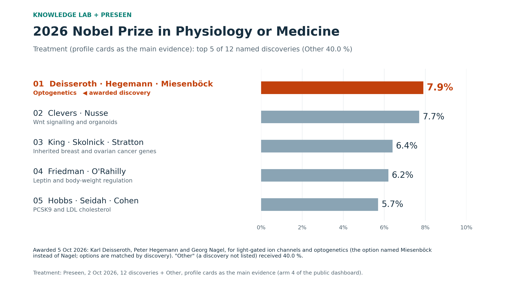
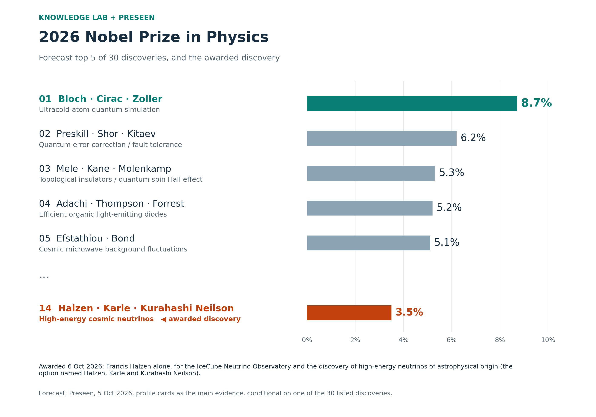
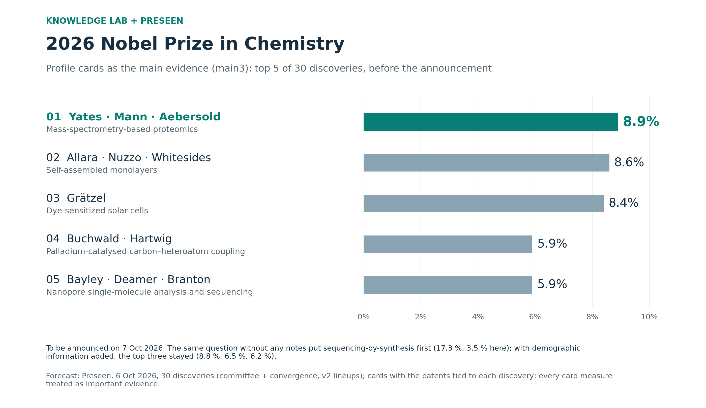
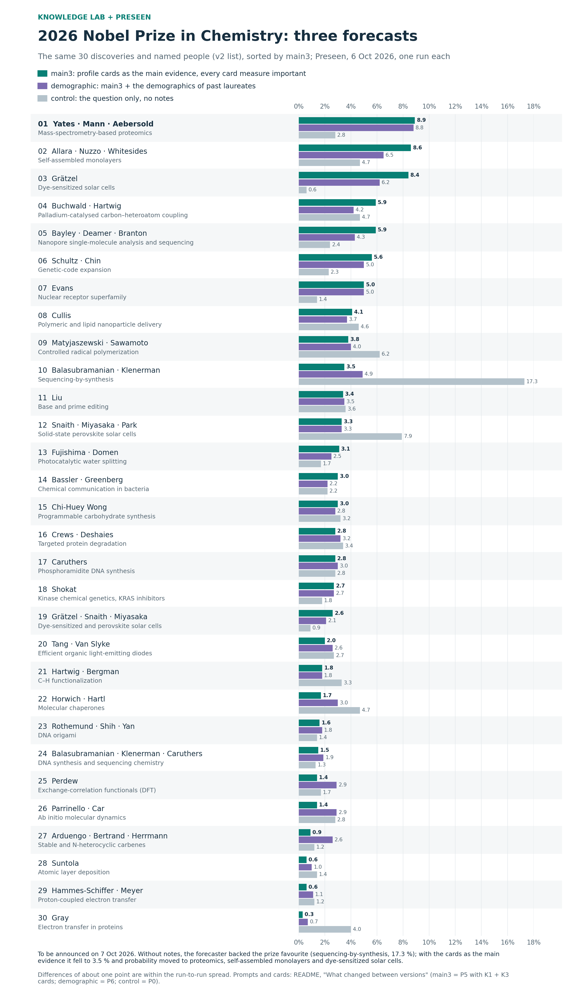
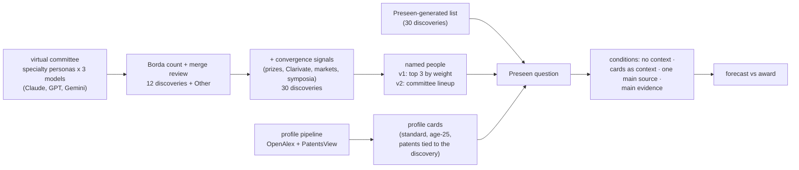

# Forecasting the 2026 Nobel Prizes: a virtual committee, bibliometric profiles and an AI forecaster

**Knowledge Lab (University of Chicago) + [Preseen](https://preseen.com).** A virtual Nobel committee of language-model
personas nominates discoveries; the nominations become multiple-choice questions of 12 or 30 discoveries, each with the
people most likely to share the prize; every named person gets a bibliometric profile card (papers, patents, books,
collaboration, compared with past laureates at the time of their prize); and Preseen's AI forecaster gives
probabilities with and without those cards. This README shows the forecasts for 2026 next to the awards.

**Contents** —
[2026 results](#2026-results) ·
[Medicine](#physiology-or-medicine-awarded-5-october) ·
[Physics](#physics-awarded-6-october) ·
[Chemistry](#chemistry-announced-7-october) ·
[What we learned](#what-we-learned-so-far) ·
[What changed between versions](#what-changed-between-versions) ·
[How the forecasts are made](#how-the-forecasts-are-made) ·
[Experiments](#experiments) ·
[Profiles of scientists](#the-data-engine-research-profiles-of-scientists) ·
[Repository layout](#repository-layout) ·
[Sources](#sources-and-licences)

---

## 2026 results

Probabilities are conditional on the prize going to one of the listed options (the 30-option questions have no
"Other"); options are matched by their discovery, so the named people need not be the laureates. The Medicine results
are those of the public dashboard (https://dawoon-jeong0523.github.io/Author_profile/): four arms of one question,
1–2 October. Forecast data: [`Data/Result/`](Data/Result/); figures:
[`docs/nobel2026/make_figures.py`](docs/nobel2026/make_figures.py).

### Physiology or Medicine (awarded 5 October)



**Award:** Karl Deisseroth, Peter Hegemann and Georg Nagel, "for their discoveries concerning light-gated ion channels
and optogenetics".

**Forecast shown** (arm 4 of the dashboard, profile cards as the main evidence, 2 October): optogenetics was the first
of the 12 named discoveries with 7.9 % ("Other" 40.0 %), ahead of Wnt signalling and organoids (7.7 %), the breast- and
ovarian-cancer susceptibility genes (6.4 %), leptin (6.2 %) and PCSK9 (5.7 %); the control favourite GLP-1 fell to
3.0 %. The option named Miesenböck where the prize went to Nagel; matched by discovery, it is the awarded option (in the
virtual committee only one optogenetics nomination named exactly Deisseroth, Hegemann and Nagel).

**The four arms** (the same question; numbers as on the dashboard):

| Arm | Runs | Optogenetics | Rank among 12 | Leading option | GLP-1 | "Other" | Distance from the control mean | Rank correlation with the control |
|---|---:|---:|---:|---|---:|---:|---:|---:|
| 1 Control | 5 | 5.5 % | 6 | GLP-1, 20.3 % | 20.3 % | 31.0 % | 1.0× | – |
| 2 Cards as context | 3 | 6.8 % | 3 | GLP-1, 19.6 % | 19.6 % | 30.4 % | 0.9× | 0.93 |
| 3 Cards as one main source | 1 | 7.4 % | 4 | orexin, 11.7 % | 11.0 % | 34.0 % | 2.8× | 0.81 |
| **4 Cards as the main evidence** | 1 | **7.9 %** | **1** | **optogenetics**, 7.9 % | 3.0 % | 40.0 % | 6.2× | −0.03 |

Distance: how far a run lands from the mean of the control runs, in units of a control run's own distance from the mean
of the other control runs (0.75 percentage points per option in Medicine). The more weight the forecaster was told to
give the cards, the higher the awarded discovery ranked — sixth without them, first as the main evidence — while the
award favourite GLP-1 fell from 20.3 % to 3.0 % and "Other" grew from 31 % to 40 %.

**How the arms were set up.** One question, *Which discovery will the 2026 Nobel Prize in Physiology or Medicine be
awarded for?*: the twelve discoveries of the virtual committee (6 specialist personas of the Medicine committee, each run
on Claude, GPT and Gemini; Borda count and merge review), each with up to three living people, and "Other"; it resolves
on the discovery in the official motivation, whoever shares the prize. Each arm is a private copy of the question with
identical wording, because context notes attach to a question:

| Arm | Context given to the forecaster | What changed from the arm above |
|---|---|---|
| 1 Control (4 runs on 1 Oct, 1 on 2 Oct) | the question only | baseline |
| 2 Cards as context (3 runs, 1 Oct) | a definitions note and 30 profile cards, one per named person (impact, defining papers, patents, textbooks, collaboration, each compared with the 2000–2025 laureates at the time of their prize), as notes to consider; no instruction | the cards are added; nothing says how to use them |
| 3 Cards as one main source (1 run, 2 Oct) | the same cards + an instruction to assume ([note](experiment/preseen_cards_balanced/instruction/00_instruction.md)): the profiles are one of the main sources, weighed comparably with prizes, news, published predictions, the history of the prize and knowledge of the field, which it should use actively; take the figures as given | the cards get weight comparable to the other evidence |
| 4 Cards as the main evidence (1 run, 2 Oct, 09:04–09:31 CDT) | the same cards + an instruction to assume ([note](experiment/preseen_cards_main/instruction/00_instruction.md)): the profiles are the main evidence for comparing the named options; judge "Other" as usual and use the profiles mainly to divide the remaining probability among the named options; base the relative probabilities primarily on the measures and reference lines; take the figures as given; prizes, news, predictions and history only as a secondary adjustment; name the profile evidence behind each leading option | the cards become the basis of the ranking |

### Physics (awarded 6 October)



**Award:** Francis Halzen alone, "for decisive contributions to the IceCube Neutrino Observatory and the discovery of
high-energy neutrinos of astrophysical origin".

- **Final forecast** (Preseen, 5 October; 30 discoveries, cards as the main evidence): ultracold-atom quantum
  simulation led with 8.7 %; neutrino astronomy was 14th with 3.5 %.
- **All conditions**:

  | Question | Condition | Runs | Neutrino astronomy | Rank | Leading option |
  |---|---|---:|---:|---:|---|
  | 12 + Other (1–2 Oct) | no context (control) | 5 | 3.7 % | 9 of 12 | optical lattice clocks, 14.7 % |
  | | cards as context | 3 | 4.1 % | 9 | optical lattice clocks, 15.4 % |
  | | cards as one of the main sources | 1 | 3.0 % | 9 | quantum simulation, 12.8 % |
  | | cards as the main evidence | 1 | 2.1 % | 11 | quantum simulation, 13.3 % |
  | 30 discoveries (5 Oct) | no context | 1 | 3.1 % | 11 of 30 | optical lattice clocks, 13.7 % |
  | | cards as the main evidence | 1 | 3.5 % | 14 | quantum simulation, 8.7 % |

  The forecasters discounted neutrino astronomy for collaboration-scale attribution (IceCube papers are signed by
  hundreds) and for the earlier neutrino prizes of 2002 and 2015. The committee answered the attribution question by
  giving the prize to one person.
- **Lineup.** The option named Halzen, Karle and Kurahashi Neilson, but two of the four committee nominations of this
  discovery had named Halzen alone: the aggregation filled three places with every name any nomination gave. The
  [v2 lineup rule](experiment/convergence_2026_v2/README.md) (the committee lineup with the highest mean score) shows
  Halzen alone.

**How each Physics forecast was set up:**

| Forecast | Question | Context given to the forecaster | What changed from the row above |
|---|---|---|---|
| 12 + Other, four conditions, 1–2 Oct | 12 committee discoveries + "Other" | as in Medicine: none; 34 profile cards + definitions; + the "one of the main sources" note; + the "main evidence" note | as in Medicine |
| 30 discoveries, no context, 5 Oct | 30 discoveries: the committee's options plus discoveries backed by recent prizes, Clarivate citation laureates, prediction markets and Nobel symposia; **no "Other"**: the forecast is conditional on a listed discovery (annulled otherwise), and when two options match, the most specific one counts | none | a longer list, and probability is spread over named discoveries only |
| 30 discoveries, cards as the main evidence, 5 Oct (final forecast) | same | four notes (`assume_true`): **(1)** a revised main-evidence instruction ([note](experiment/preseen_30_main_v2/instruction/00_1_instruction.md)): judge each option by its named people and state the rule that combines them; career impact and discovery-relevant works are primary, textbook reach supporting, technological translation and collaboration minor; down-weight only for visible attribution anomalies, fewer than about 50 works, or works after 2018; apply the timing prior once; use the Medicine outcome only for calibration; other information may change an option by a factor of 0.5–2, each factor listed; no uniform floor; report the profiles-only and the adjusted distribution. **(2)** definitions of the age-25 cards. **(3)** the timing base rate of the 2000–2025 Physics prizes (lags from the decisive paper to the prize). **(4)** the Medicine 2026 outcome (announced the day before). Plus 30 option blocks (`consider`): an option summary line, the anchor works with their maturity line, an attribution-confidence line, and the age-25 profile of each named person | age-25 cards grouped by option, explicit weighting rules, a timing base rate and this year's Medicine outcome |

Earlier on 5 October, two runs tested the steps in between (in `experiment/preseen_main_no_other/` and
`experiment/preseen_30_no_other/`): the 12 discoveries without "Other" under the 2 October main-evidence note, and the
30 discoveries under that note with the standard cards.

### Chemistry (announced 7 October)



**Forecast shown** (Preseen, 6 October; arm *main3*): the v2 list of 30 discoveries, profile cards with the patents tied
to each discovery as the main evidence, every card measure treated as important. Proteomics leads with 8.9 %, then
self-assembled monolayers (8.6 %), dye-sensitized solar cells (8.4 %), palladium-catalysed carbon–heteroatom coupling
and nanopores (5.9 % each). The scores against the award will be added after the announcement.

**All Chemistry forecasts** (one run each, 6 October; [comparison](experiment/preseen_chem30_main/results/compare.md);
prompt and card versions as in [What changed between versions](#what-changed-between-versions)):

| List | Arm: prompt and cards | Top 3 | Sequencing-by-synthesis |
|---|---|---|---:|
| v2 lineups (C3) | control: no notes (P0) | sequencing-by-synthesis 17.3 %, perovskite solar cells 7.9 %, controlled radical polymerization 6.2 % | 17.3 % |
| v1 lineups (C2) | main: main-evidence prompt P3, standard cards (K1) | proteomics 9.1 %, dye-sensitized solar cells 8.9 %, nanopores 6.5 % | 2.4 % |
| v2 lineups | main: prompt P3, standard cards (K1) | proteomics 8.7 %, dye-sensitized solar cells 8.5 %, nanopores 7.9 % | 2.4 % |
| v2 lineups | main2: prompt P4, cards with patents (K1 + K3) | proteomics 8.5 %, nanopores 6.7 %, self-assembled monolayers 6.5 % | 4.0 % |
| v2 lineups | **main3: prompt P5, cards with patents (K1 + K3)** | **proteomics 8.9 %, self-assembled monolayers 8.6 %, dye-sensitized solar cells 8.4 %** | 3.5 % |
| v2 lineups | demographic: prompt P6 (P5 + demographic notes), cards with patents (K1 + K3) | proteomics 8.8 %, self-assembled monolayers 6.5 %, dye-sensitized solar cells 6.2 % | 4.9 % |
| generated by Preseen (C4) | main: prompt P3, standard cards (K1) | flexible electronics / e-skin 7.7 %, synthetic gene circuits 7.3 %, heterogeneous-catalysis theory 7.1 % | 3.6 % (as "next-generation DNA sequencing") |

- **Without notes the forecaster backs the prize favourite.** Sequencing-by-synthesis (Wolf, Gairdner and Princess of
  Asturias awards) leads the control with 17.3 %; under any main-evidence prompt it falls to 2–5 %.
- **Patents on the cards help inventions a little and hurt theory.** With the patents tied to each discovery
  (main2, main3), sequencing-by-synthesis rose from 2.4 % to 3.5–4.0 % — the forecaster counted the Solexa patents as
  discovery evidence but still discounted the option for maturity and for its inventors' median citation impact. In
  main3 it gave "discovery-tied patents" a weight of 0.15, so theoretical discoveries without patents fell: DFT
  functionals from 5.8 % to 1.4 %, ab initio molecular dynamics from 5.3 % to 1.4 %.
- **The demographic notes barely mattered.** Allowed a factor of 0.5–2 per option, the forecaster used 0.94–1.10:
  0.94 for materials options after the materials prizes of 2023 and 2025, 1.08–1.10 for the two options that name a
  woman, about 1.04 for most others. The demographic arm and main3 agree at a rank correlation of 0.87, about the
  run-to-run spread.

**main3, demographic and control on all 30 discoveries** (the named people above each discovery; every run with the
discoveries, people and probabilities: [comparison](experiment/preseen_chem30_main/results/compare.md)):



**How each Chemistry forecast was set up** (all on 6 October, one run each; times CDT):

| Forecast | Question | Context given to the forecaster | What changed from the row above |
|---|---|---|---|
| v1, v2 and Preseen list, main (submitted 12:44–12:53) | *Which discovery will the 2026 Nobel Prize in Chemistry be awarded for?*: 30 discoveries, **no "Other"** (conditional on a listed discovery, annulled otherwise; when two options match, the most specific one counts), worded as the Physics 30-option question. Three lists: **v1** (C2) and **v2** (C3), the same 30 committee + convergence discoveries with different named people, and **Preseen's own list** (C4) | prompt **P3**, five notes (`assume_true`, [notes](experiment/preseen_chem30_main/instruction_used_2026-10-06/)): **(1)** the main-evidence instruction of the final Physics forecast adapted to Chemistry: judge each option by its named people and state the rule that combines them; a defining work counts for an option only if it is relevant to its discovery; career impact and discovery-relevant works primary, textbook reach supporting, technological translation and collaboration minor, disruption little weight; read translation against the laureate medians (about 200 citing inventions, 6 own US patents); down-weight only for visible attribution anomalies, fewer than about 50 works or works after 2018; apply the timing prior once; use the Medicine and Physics outcomes only to calibrate how a motivation pairs a discovery with the realization that made it a tool and how credit followed the decisive works (Physics went to one person), "saying nothing about which area of chemistry is due"; other information only as a factor of 0.5–2 per option, each listed; no uniform floor; report the profiles-only and the adjusted distribution and the laureates expected for the top three. **(2)** definitions of the standard cards. **(3)** timing base rate of the 2000–2025 Chemistry prizes (lag from the decisive work; median about 25 years). **(4)** the Medicine 2026 outcome. **(5)** the Physics 2026 outcome. Plus one standard card (K1) per named person as a note to consider (v1 63, v2 51, Preseen list 55) | against the final Physics forecast: Chemistry wording and reference values, both earlier 2026 outcomes, standard person cards instead of age-25 option blocks |
| v2 control (14:47) | the v2 question | none | the notes removed |
| v2 main2 (16:59) | the v2 question | prompt **P4** ([notes](experiment/preseen_chem30_main/instruction_used_main2_2026-10-06/)): instruction (1) with technological translation no longer minor and the patents tied to the discovery counted as discovery-relevant works (collaboration still minor); definitions (2) with the patent section; (3)–(5) unchanged. Cards **K1 + K3**: each of the 51 cards gains "Patents tied to the discovery" (up to three of the person's US patents most tied to the discovery, with assignee and later citing patents) | against v2 main: translation no longer minor; patents on the cards |
| **v2 main3 (17:03), the forecast shown** | the v2 question | prompt **P5** ([notes](experiment/preseen_chem30_main/instruction/)): instruction (1) without an order of the measures: all the information on the profiles is important evidence (career impact, the defining works and the patents tied to the discovery, technological translation, textbook reach, collaboration, disruption and Foundation values), each read against its reference line; only outside information (prizes, news, predictions, the history of the prize) stays a secondary factor of 0.5–2; (2)–(5) and the cards as in main2 | no measure called minor |
| v2 demographic (17:07) | the v2 question | prompt **P6** ([notes](experiment/preseen_chem30_main/instruction_demo/)): the main3 notes, with one sentence of (1) changed so that this year's laureates enter only through the demographic note, plus **(6)** the gender, country of birth, citizenship and country of work of the 2000–2025 Chemistry laureates (PrizeAtlas), the area of chemistry of each prize, and the 2026 Physics and Medicine laureates, and **(7)** an instruction to compare each option's people and area with that distribution and apply an explicit demographic factor of 0.5–2 per option, reporting the distribution before and after; the same 51 cards | the demographic notes |

## What we learned so far

- **The context changes the forecast far more than the names on an option.** On the same 30 chemistry discoveries the
  main-evidence instruction and the control agree on the ranking with a rank correlation of 0.14; v1 and v2 lineups
  under the same instruction agree at 0.95.
- **Profile cards favour academically cited careers.** Under "cards as the main evidence" the forecaster ranks options
  by the career impact of the named people. That helped optogenetics (first in Medicine), but it pushes down
  inventions whose evidence sits in patents rather than papers: sequencing-by-synthesis fell from 17.3 % without context
  to 2.4 % (its inventors' citation impact is near the laureate median; their technology impact, at the 92nd–97th
  percentile of laureates, was treated as minor). Listing the patents tied to each discovery on the cards raised it
  only to 3.5–4.9 %, and pushed down theoretical discoveries that have no patents.
- **Name the people the evidence supports, not three by default.** Physics went to one person; the committee had said
  so in half of its nominations.
- **Where the awarded discoveries stood.** Medicine's optogenetics was the first named option when the cards were the
  main evidence, but sixth without them; Physics' neutrino astronomy ranked 9th to 14th under every condition.

## How the forecasts are made



- **Committee** ([`experiment/preseen/`](experiment/preseen/README.md)): personas with the specialties of the 2026
  committees, each run on `claude-opus-5-5`, `gpt-5.5-2026-04-23` and `gemini-3.1-pro-preview`; a model-balanced Borda
  count and a recorded merge review give the candidate discoveries.
- **30-option lists** ([`experiment/convergence_2026/`](experiment/convergence_2026/README.md),
  [`experiment/convergence_2026_v2/`](experiment/convergence_2026_v2/README.md)): the committee options plus evidence
  from recent prizes, Clarivate citation laureates, prediction markets and Nobel symposia, as extra voters.
- **Profile cards**: one card per named person from the [profile pipeline](docs/author_profiles.md), each measure
  compared with the field's 2000–2025 laureates at the time of their prize. The age-25 cards count only works and
  patents from age 25 on (merged author records often carry a namesake's early papers) and choose the three works most
  tied to the discovery.
- **Conditions**: the same question on Preseen with no context, with the cards as context, with an instruction to use
  them as one of the main sources, or as the main evidence (with the year's earlier outcomes and a timing base rate as
  reference notes).

## What changed between versions

### Candidate generation (the committee algorithm)

| Version | Date | How the options and their named people are made | Used in |
|---|---|---|---|
| C1 committee, 12 + Other | 1 Oct | Virtual committee: specialty personas of the 2026 committees (Medicine 6, Physics 8, Chemistry 8), each run on Claude, GPT and Gemini, nominate up to five discoveries with one to three living people each. A model-balanced Borda count and a recorded merge review give 12 discoveries + "Other". **People**: every name in the merged nominations, ranked by summed Borda weight, top three shown. | Medicine and Physics, all four arms (1–2 Oct) |
| C2 30 options, v1 lineups ([`convergence_2026/`](experiment/convergence_2026/README.md)) | 5 Oct | C1 plus person-level evidence as extra approval voters (Clarivate 2026, prediction markets, recent major prizes, milestones, Nobel symposia, web sources), scaled to the committee's total; an option the committee did not name needs two evidence families; hand-checked groupings in `decisions.yaml`. No "Other". **People**: top three living by committee weight + convergence points. | Physics 30-option runs (5 Oct), Chemistry v1 list |
| C3 30 options, v2 lineups ([`convergence_2026_v2/`](experiment/convergence_2026_v2/README.md)) | 6 Oct | Same options as C2. **People**: the lineup one committee nomination actually wrote (the set of people of one nomination) with the highest mean person score, instead of filling three places with every name any nomination gave — Physics would have shown Halzen alone. Chemistry: 1-person options 6 → 10, 3-person 16 → 8. | Chemistry v2 list (all v2 arms) |
| C4 Preseen-generated ([`preseen_generated30/`](experiment/preseen_generated30/README.md)) | 6 Oct | Preseen's own question drafting (`normalize`) with guidance: 30 discoveries, one to three living people each, no padding to three, mutually exclusive options. | Chemistry Preseen list |

### Prompts (notes the forecaster receives)

| Version | Date | Notes (`assume_true` unless stated) | What changed |
|---|---|---|---|
| P0 control | 1–6 Oct | none | — |
| P1 cards as context | 1 Oct | definitions + profile cards (`consider`), no instruction | cards added |
| P2a one main source / P2b main evidence | 2 Oct | P1 + an instruction: the cards are one of the main sources (P2a) or the main evidence, other information only a secondary adjustment (P2b) | how the cards are to be used |
| P3 main evidence, chemistry | 6 Oct | 00_1 instruction (judge each option by its named people; state the rule; career impact and discovery-relevant works primary, textbook reach supporting, **technological translation and collaboration minor**; disruption "little weight"; timing prior once; other information as a factor of 0.5–2; no uniform floor), 00_2 card definitions, 00_3 chemistry timing base rate, 00_4 Medicine 2026 outcome, 00_5 Physics 2026 outcome | adapted from the 5 October physics prompt; both earlier 2026 outcomes added |
| P4 (main2) | 6 Oct | P3 with technological translation no longer "minor"; patents tied to the discovery count as discovery-relevant works; definitions with the patent line | translation re-weighted, patents added |
| P5 (main3) | 6 Oct | P4 with **no measure called minor**: all the information on the profiles is important evidence (impact, defining works and patents, technological translation, textbook reach, collaboration, disruption and Foundation), each read against its reference line; only outside information (prizes, news, predictions) stays secondary | the evidence hierarchy removed |
| P6 (demographic) | 6 Oct | P5 + 00_6 demographics of the 2000–2025 Chemistry laureates (gender, birth country, citizenship, country of work, area) and the 2026 Physics and Medicine laureates + 00_7: weigh the demographic distribution with an explicit factor of 0.5–2 per option, reported apart; one sentence of 00_1 changed so that this year's laureates enter only through the demographic note | demographic information added |

The physics prompt of 5 October (the final Physics forecast) is P2b revised into four notes with age-25 option blocks;
see [How each Physics forecast was set up](#physics-awarded-6-october).

### Data cards

| Version | Date | What a card holds | Change |
|---|---|---|---|
| K1 standard | 1 Oct | impact (median percentile, top 10 % / 1 % shares), the three most-cited works, technological translation (citing inventions, own patents), textbook reach, collaboration — each against the field's 2000–2025 laureates at prize time | — |
| K2 age-25 ([`cards_age25`](experiment/convergence_2026_v2/README.md)) | 5 Oct (physics); chemistry built 6 Oct, not used in a run | works and patents from the year the person turned 25 (removes namesakes' early papers merged into author records); the reference rebuilt the same way; the three **defining works chosen by an LLM review for relevance to the discovery** instead of the most cited; physics option blocks with anchor works, maturity and attribution confidence | window and defining works |
| K3 patents tied to the discovery | 6 Oct (chemistry) | K1 (and the chemistry K2 cards) + a section with up to three of the person's US patents most tied to the discovery (filing and grant year, assignee, later citing patents) and how many of the person's patents relate to it, chosen by an LLM from all the person's US utility patents granted up to 2021 | patent evidence added |

Identity fixes behind the cards of 6 October: C. Frank Bennett was no longer matched to Charles H. Bennett, Lap-Chee
Tsui's nine split records were merged, David Huang and Richmond Sarpong (named "Richard" by Preseen) were resolved by
hand, and 25 chemistry birth years without an unambiguous Wikidata date were set by hand for the age-25 cards
(Wikidata was wrong for Brangwynne, Ritala and Winkler). The Chemistry runs of 6 October used K1 cards (main on the
three lists) or K1 + K3 (main2, main3, demographic); the control had no cards.

## Experiments

| Folder | Date | What |
|---|---|---|
| [`experiment/preseen/`](experiment/preseen/README.md) | 1 Oct | committee, 12 + Other per field; control vs cards as context (4 + 3 runs per field) |
| [`experiment/preseen_cards_main/`](experiment/preseen_cards_main/) | 2 Oct | cards as the main evidence; combined page of the four conditions: https://dawoon-jeong0523.github.io/Author_profile/ |
| [`experiment/preseen_cards_balanced/`](experiment/preseen_cards_balanced/) | 2 Oct | cards as one of the main sources |
| [`experiment/convergence_2026/`](experiment/convergence_2026/README.md) | 5 Oct | 30-option lists (physics, chemistry), cards, age-25 physics cards |
| `experiment/preseen_main_no_other/`, `preseen_30_no_other/`, `preseen_12_main_v2/`, `preseen_30_main_v2/`, `preseen_5_main_v2/` | 5 Oct | physics: 12, 30 and 5 options without "Other", main evidence and control |
| [`experiment/convergence_2026_v2/`](experiment/convergence_2026_v2/README.md) | 6 Oct | v2 lineup rule, medicine list, v1/v2 comparison, cards for every list, age-25 chemistry cards |
| [`experiment/preseen_generated30/`](experiment/preseen_generated30/README.md) | 6 Oct | 30 chemistry options generated by Preseen |
| `experiment/preseen_chem30_main/` | 6 Oct | chemistry: main evidence on three lists; on v2 also control, main2, main3 and the demographic arm ([LOG](experiment/preseen_chem30_main/LOG.md)) |
| [`Data/Result/`](Data/Result/) | 2–6 Oct | forecast tables behind the figures (Medicine: arm 4 of 2 October; Physics: 5 October; Chemistry: main3 of 6 October) and the figure notebook |
| [`handoff/`](handoff/README.md) | 3 Oct | context and forecasts of the four conditions, kept apart, for Preseen |

## The data engine: research profiles of scientists

Every card comes from a profile pipeline that turns a name into a dashboard and an agent-readable record of a career:
every paper and patent scored against its cohort (citations, disruption, Foundation / Extension / Generalization,
citations from books), patent → paper citations, and the co-authorship, co-invention, institution and assignee
networks, from the OpenAlex 2026-01 snapshot, PatentsView 2025-12-31, Reliance on Science and the *Science of Science*
metric pipelines. It works for anybody with an OpenAlex author profile and has profiled all 656 OpenAlex ids of the
physics, chemistry and medicine laureates of 1901–2025.

```bash
python pipeline/profile_person.py "Geoffrey Hinton" --wait
# dashboard: output/dashboard/2024_Physics_Geoffrey-Hinton_A5108093963.html
# record:    output/record/2024_Physics_Geoffrey-Hinton_A5108093963.md
```

Full documentation — example, quick start, name resolution, inventor linking, outputs, measures, configuration, batch
runs, data inputs and caveats: **[`docs/author_profiles.md`](docs/author_profiles.md)**.

## Repository layout

```
Nobel Prize/
├── README.md                         this page (Nobel forecasts)
├── docs/
│   ├── nobel2026/                    README figures and make_figures.py
│   ├── author_profiles.md            documentation of the profile pipeline
│   └── example/hinton/               figures of the profile example
├── Data/
│   ├── Result/                       final 2026 forecasts (medicine, physics) and the figure notebook
│   ├── convergence_2026.csv          person-level evidence for the 30-option lists
│   ├── prizeatlas/                   PrizeAtlas laureate tables (CSV; SOURCE.md)
│   ├── Li2019/, SciSciNet_Link_NobelLaureates.tsv   laureate publication records
├── experiment/                       committee, candidate lists, cards, Preseen runs (see Experiments)
├── handoff/                          context and forecasts for Preseen
├── manuscript/                       LaTeX write-up of the 1 October experiment
├── pipeline/profile_person.py        name -> author id -> Slurm job -> dashboard + record
├── notebook/                         author_profile.ipynb, nobel_laureate_papers.ipynb, prizeatlas_crawl.ipynb, np_common.py
├── jobs/                             Slurm runners
└── requirements.txt
```

Not versioned (`.gitignore`): `output/` (dashboards, records, per-person folders), `cache/` (shared parquet caches),
`jobs/logs/`, `Data/prizeatlas/html/`, every `*.parquet` file, Preseen client state (`experiment/**/preseen_exp/`) and
run logs.

## Sources and licences

OpenAlex (CC0), PatentsView (CC BY 4.0), Reliance on Science (Marx & Fuegi; CC BY 4.0), SciSciNet laureate links,
Li, Yin, Fortunato & Wang (2019) *A dataset of publication records for Nobel laureates*, Scientific Data 6:33
(Harvard Dataverse doi:10.7910/DVN/6NJ5RN), PrizeAtlas (CC BY-SA 4.0, https://prizeatlas.org). Data tables derived from
PrizeAtlas keep its CC BY-SA licence (`Data/prizeatlas/SOURCE.md`). Forecasts: Preseen (https://preseen.com).
