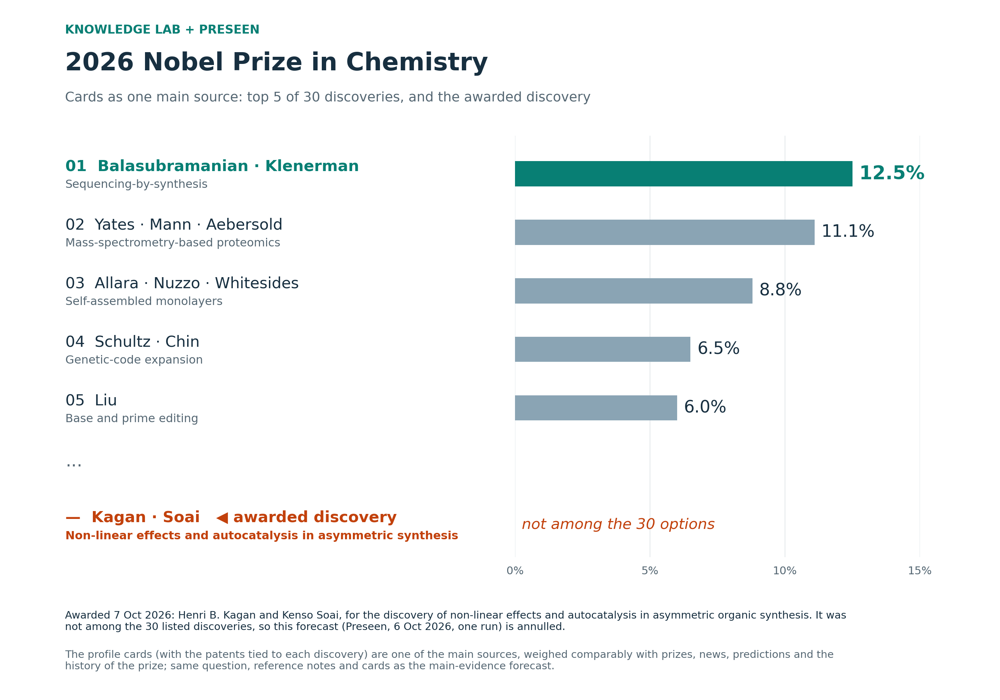
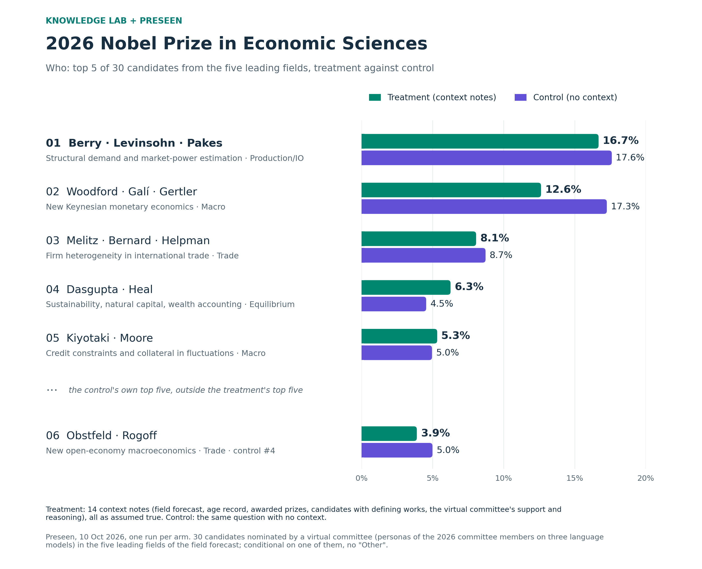
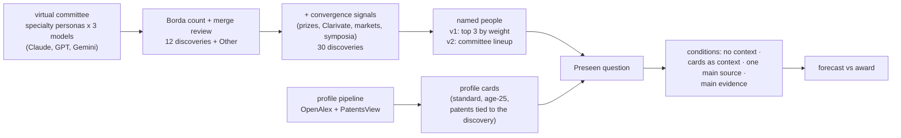

# Forecasting the 2026 Nobel Prizes: a virtual committee, bibliometric profiles and an AI forecaster

**Knowledge Lab (University of Chicago) + [Preseen](https://preseen.com).** A virtual Nobel committee of language-model
personas nominates discoveries; the nominations become multiple-choice questions of 12 or 30 discoveries, each with the
people most likely to share the prize; every named person gets a bibliometric profile card (papers, patents, books,
collaboration, compared with past laureates at the time of their prize); and Preseen's AI forecaster gives
probabilities with and without those cards. This README shows the forecasts for 2026 next to the awards.

**Contents** —
[2026 results](#2026-results) ·
[Medicine](#physiology-or-medicine-awarded-5-october) ·
[Physics](#physics-awarded-6-october) ·
[Chemistry](#chemistry-awarded-7-october) ·
[Economic Sciences](#economic-sciences-to-be-announced-12-october) ·
[What we learned](#what-we-learned-so-far) ·
[What changed between versions](#what-changed-between-versions) ·
[How the forecasts are made](#how-the-forecasts-are-made) ·
[Experiments](#experiments) ·
[Profiles of scientists](#the-data-engine-research-profiles-of-scientists) ·
[Repository layout](#repository-layout) ·
[Sources](#sources-and-licences)

---

## 2026 results

Probabilities are conditional on the prize going to one of the listed options (the 30-option questions have no
"Other"); options are matched by their discovery, so the named people need not be the laureates. In Medicine and
Physics the main result is **cards as the main evidence** (the profile cards are the main evidence of the forecast), in
Chemistry **cards as one main source** (the profiles are one of the main sources, weighed comparably with prizes, news,
predictions and the history of the prize); the **control** has no notes. The Medicine results
are those of the public dashboard (https://dawoon-jeong0523.github.io/Author_profile/): four arms of one question,
1–2 October. Forecast data: [`Data/Result/`](Data/Result/); figures:
[`docs/nobel2026/make_figures.py`](docs/nobel2026/make_figures.py).
Each field below is collapsed: click its summary line to open the figures, tables and set-up. The economics prize
(announced on 12 October) is forecast in two stages, the field first and then the candidates; see its section.

### Physiology or Medicine (awarded 5 October)

<details>
<summary><b>Award:</b> Deisseroth, Hegemann and Nagel (optogenetics) · <b>cards as the main evidence:</b> optogenetics first of 12 named discoveries (7.9 %; "Other" 40.0 %). <i>Click to expand.</i></summary>


**Award:** Karl Deisseroth, Peter Hegemann and Georg Nagel, "for their discoveries concerning light-gated ion channels
and optogenetics".

**Cards as the main evidence** (2 October; arm 4 of the
[public dashboard](https://dawoon-jeong0523.github.io/Author_profile/); [Preseen report](Data/Result/Medicine/Treatment.pdf)): optogenetics was the first of the 12 named
discoveries with 7.9 % ("Other" 40.0 %), ahead of Wnt signalling and organoids (7.7 %), the breast- and
ovarian-cancer susceptibility genes (6.4 %), leptin (6.2 %) and PCSK9 (5.7 %); the control favourite GLP-1 fell to
3.0 %. The option named Miesenböck where the prize went to Nagel; matched by discovery, it is the awarded option (in the
virtual committee only one optogenetics nomination named exactly Deisseroth, Hegemann and Nagel).

**All Medicine forecasts** (the same question; numbers as on the dashboard):

| Forecast | Runs | Optogenetics | Rank among 12 | Leading option | GLP-1 | "Other" | Distance from the control mean | Rank correlation with the control | Preseen report |
|---|---:|---:|---:|---|---:|---:|---:|---:|---|
| Control | 5 | 5.5 % | 6 | GLP-1, 20.3 % | 20.3 % | 31.0 % | 1.0× | – | |
| Cards as context | 3 | 6.8 % | 3 | GLP-1, 19.6 % | 19.6 % | 30.4 % | 0.9× | 0.93 | |
| Cards as one main source | 1 | 7.4 % | 4 | orexin, 11.7 % | 11.0 % | 34.0 % | 2.8× | 0.81 | |
| **Cards as the main evidence** | 1 | **7.9 %** | **1** | **optogenetics**, 7.9 % | 3.0 % | 40.0 % | 6.2× | −0.03 | [PDF](Data/Result/Medicine/Treatment.pdf) |

Distance: how far a run lands from the mean of the control runs, in units of a control run's own distance from the mean
of the other control runs (0.75 percentage points per option in Medicine). The more weight the forecaster was told to
give the cards, the higher the awarded discovery ranked — sixth without them, first as the main evidence — while the award
favourite GLP-1 fell from 20.3 % to 3.0 % and "Other" grew from 31 % to 40 %.

**How each Medicine forecast was set up** (1–2 October):

- **Committee.** Six personas with the specialties of the 2026 Medicine committee, each run on Claude, GPT and Gemini,
  nominated discoveries with one to three living people each; a model-balanced Borda count and a recorded merge review
  gave 12 discoveries and "Other" ([committee review](experiment/preseen/committee/medicine/review.md)). The people of an
  option are the top three names of all nominations merged into it, by summed Borda weight.
- **Question.** *Which discovery will the 2026 Nobel Prize in Physiology or Medicine be awarded for?*, resolved on the
  discovery in the official motivation, whoever shares the prize ([question](experiment/preseen_cards_main/questions/medicine.json));
  each forecast is a private copy with identical wording.
- **Prompts.**
  - Control: the question only.
  - Cards as context: a definitions note and 30 profile cards, one per named person, as notes to consider; no
    instruction ([definitions](experiment/preseen/cards/medicine/00_definitions.md), [cards](experiment/preseen/cards/medicine/)).
  - Cards as one main source: the same cards and an instruction that the profiles are one of the main sources,
    weighed comparably with prizes, news, predictions and the history of the prize
    ([instruction](experiment/preseen_cards_balanced/instruction/00_instruction.md)).
  - **Cards as the main evidence**: the same cards and an instruction that the profiles are the main evidence for comparing the named
    options: judge "Other" as usual, divide the rest mainly by the measures and their reference lines, and use prizes,
    news, predictions and history only as a secondary adjustment
    ([instruction](experiment/preseen_cards_main/instruction/00_instruction.md),
    [definitions](experiment/preseen_cards_main/cards/medicine/00_definitions.md), [cards](experiment/preseen_cards_main/cards/medicine/)).


</details>

### Physics (awarded 6 October)

<details>
<summary><b>Award:</b> Francis Halzen (IceCube, astrophysical neutrinos) · <b>cards as the main evidence:</b> quantum simulation first (8.7 %), neutrino astronomy 14th of 30 (3.5 %). <i>Click to expand.</i></summary>


**Award:** Francis Halzen alone, "for decisive contributions to the IceCube Neutrino Observatory and the discovery of
high-energy neutrinos of astrophysical origin".

**Cards as the main evidence** (Preseen, 5 October; 30 discoveries;
[Preseen report](Data/Result/Physics/Treatment.pdf)): ultracold-atom quantum
simulation led with 8.7 %; neutrino astronomy was 14th with 3.5 %.

**All Physics forecasts:**

| Question | Forecast | Runs | Neutrino astronomy | Rank | Leading option | Preseen report |
|---|---|---:|---:|---:|---|---|
| 12 + Other (1–2 Oct) | control | 5 | 3.7 % | 9 of 12 | optical lattice clocks, 14.7 % | |
| | cards as context | 3 | 4.1 % | 9 | optical lattice clocks, 15.4 % | |
| | cards as one main source | 1 | 3.0 % | 9 | quantum simulation, 12.8 % | |
| | cards as the main evidence | 1 | 2.1 % | 11 | quantum simulation, 13.3 % | |
| 30 discoveries (5 Oct) | control | 1 | 3.1 % | 11 of 30 | optical lattice clocks, 13.7 % | [PDF](Data/Result/Physics/Control.pdf) |
| | **cards as the main evidence** | 1 | 3.5 % | 14 | quantum simulation, 8.7 % | [PDF](Data/Result/Physics/Treatment.pdf) |

The forecasters discounted neutrino astronomy for collaboration-scale attribution (IceCube papers are signed by
hundreds) and for the earlier neutrino prizes of 2002 and 2015. The committee answered the attribution question by giving
the prize to one person. The option named Halzen, Karle and Kurahashi Neilson, but two of the four committee
nominations of this discovery had named Halzen alone.

**How each Physics forecast was set up:**

- **Committee.** Eight personas with the specialties of the 2026 Physics committee (Claude, GPT, Gemini), Borda count
  and merge review: 12 discoveries and "Other" for the 1–2 October forecasts
  ([committee review](experiment/preseen/committee/physics/review.md)). For 5 October the list grew to **30 discoveries
  without "Other"**: the committee's options plus discoveries backed by recent prizes, Clarivate citation laureates,
  prediction markets and Nobel symposia, counted as extra voters
  ([30-option list](experiment/convergence_2026/README.md), [options](experiment/convergence_2026/results/options_physics.csv)). The
  people of an option are still the top three of all merged names, which put Karle and Kurahashi Neilson next to
  Halzen; the [v2 lineup rule](experiment/convergence_2026_v2/README.md) (the committee lineup with the highest mean score)
  shows Halzen alone.
- **Question.** The 30-option question is conditional on a listed discovery (annulled otherwise); when two options
  match, the most specific one counts ([question](experiment/preseen_30_main_v2/questions/physics.json)).
- **Prompts.**
  - 12 + Other: the four prompts of Medicine (control, cards as context, one main source, main evidence).
  - 30 discoveries, control: the question only.
  - **Cards as the main evidence**, against the 2 October main-evidence note: the cards are grouped into one block per option with
    its anchor works, their maturity and an attribution-confidence line, built from age-25 cards (works and patents
    from age 25 on, defining works chosen for relevance to the discovery); explicit weighting (career impact and
    discovery-relevant works primary, textbook reach supporting, technological translation and collaboration minor);
    down-weighting only for attribution anomalies, small samples or works after 2018; a timing base rate applied
    once; the Medicine outcome of the day before, for calibration only; other information as a factor of 0.5–2 per
    option; the profiles-only and adjusted distributions reported
    ([instruction](experiment/preseen_30_main_v2/instruction/00_1_instruction.md),
    [definitions](experiment/preseen_30_main_v2/instruction/00_2_definitions.md),
    [timing base rate](experiment/preseen_30_main_v2/instruction/00_3_timing_base_rate.md),
    [Medicine outcome](experiment/preseen_30_main_v2/instruction/00_4_medicine_2026.md),
    [option blocks](experiment/preseen_30_main_v2/cards/physics/)).


</details>

### Chemistry (awarded 7 October)

<details>
<summary><b>Award:</b> Kagan and Soai (non-linear effects and autocatalysis in asymmetric synthesis), not among the 30 options · <b>cards as one main source:</b> sequencing-by-synthesis first (12.5 %). <i>Click to expand.</i></summary>



**Award:** Henri B. Kagan and Kenso Soai, "for the discovery of non-linear effects and autocatalysis in asymmetric
organic synthesis".

**Cards as one main source** (Preseen, 6 October, one run;
[forecast table](Data/Result/nobel_chemistry_2026_one_main_source.csv)): 30 discoveries, profile cards with the
patents tied to each discovery as one of the main sources, weighed comparably with prizes, news, predictions and the
history of the prize; the same question, reference notes and cards as the main-evidence forecast.
Sequencing-by-synthesis led with 12.5 %, then proteomics (11.1 %), self-assembled monolayers (8.8 %), genetic-code
expansion (6.5 %) and base and prime editing (6.0 %). **The awarded discovery was not among the 30 options**, so this
forecast and the other 30-option forecasts of 6 October are annulled: the question is conditional on a listed
discovery.

**Where the award stood in our pipeline:**

- **Virtual committee:** no nomination named Kagan, Soai or the discovery
  ([committee review](experiment/preseen/committee/chemistry/review.md)).
- **Convergence evidence:** Soai appeared once, from the 2021 Nobel Symposium "Chiral Matters", but filed under
  physics and with a single evidence family, where an option the committee did not name needs two; so he never became
  an option ([evidence](Data/convergence_2026.csv)). Kagan was not in the evidence.
- **Preseen's own list of 30:** the nearest option was Eric Jacobsen's catalytic asymmetric epoxidation (2.5 %), the
  same broad area but a different discovery.
- The prize surprised outside forecasters as well: neither laureate was a Clarivate citation laureate or on the major
  prediction lists ([Chemistry World](https://www.chemistryworld.com/news/the-nobel-prize-in-chemistry-2026-as-it-happens-live/4024303.article)).

**Scored forecasts: 12 discoveries + "Other" (1–2 October).** Only the Chemistry question of 1–2 October had "Other",
which the award resolves to (the committee's 12 discoveries; the four prompts of Medicine;
[runs](experiment/preseen_cards_main/results/chemistry/runs_long.csv)):

| Forecast | Runs | "Other" | Log score ln(p) |
|---|---:|---:|---:|
| Control | 5 | 33.6 % (32.0–34.6) | −1.09 |
| Cards as context | 3 | 33.1 % (32.1–34.4) | −1.10 |
| Cards as one main source | 1 | 37.5 % | −0.98 |
| Cards as the main evidence | 1 | 38.0 % | −0.97 |

"Other" was the largest single probability in every run. The two forecasts told how to use the cards put more on
"Other" (37.5–38.0 %) than the control and cards as context (33–34 %), as in Medicine (31 % to 40 %); the differences
are small and rest on one to five runs per forecast.

**All Chemistry forecasts of 6 October** (30 discoveries, the same question, one run each; all annulled by the
award; all 30 options with their named people:
[comparison](experiment/preseen_chem30_main/results/compare.md)):

| Forecast | Notes | Top 3 | Rank correlation with cards as one main source | Preseen report | Top 5 |
|---|---|---|---:|---|---|
| **Cards as one main source** | profile cards with patents as one of the main sources, weighed comparably with prizes, news, predictions and the history of the prize | **sequencing-by-synthesis 12.5 %, proteomics 11.1 %, self-assembled monolayers 8.8 %** | – | – | [figure](docs/nobel2026/chemistry_2026_top5_one_main_source.png) |
| Cards as the main evidence | the same notes and cards; instruction: the profiles are the main evidence, every card measure important, other information only a secondary adjustment | proteomics 8.9 %, self-assembled monolayers 8.6 %, dye-sensitized solar cells 8.4 % | 0.83 | [PDF](Data/Result/Chemistry/Treatment.pdf) | [figure](docs/nobel2026/chemistry_2026_top5_main3.png) |
| Cards as context | the same notes and cards, no instruction | sequencing-by-synthesis 22.9 %, perovskite solar cells 8.1 %, controlled radical polymerization 6.2 % | 0.81 | – | [figure](docs/nobel2026/chemistry_2026_top5_cards_context.png) |
| Demographic | the notes of cards as the main evidence + the demographics of past laureates | proteomics 8.8 %, self-assembled monolayers 6.5 %, dye-sensitized solar cells 6.2 % | 0.81 | [PDF](Data/Result/Chemistry/Demographic.pdf) | – |
| Control | none | sequencing-by-synthesis 17.3 %, perovskite solar cells 7.9 %, controlled radical polymerization 6.2 % | 0.71 | [PDF](Data/Result/Chemistry/Control.pdf) | – |

- **The more weight the cards get, the further the forecast moves from the control.** Rank correlation with the
  control: cards as context 0.88, cards as one main source 0.71, cards as the main evidence 0.32. Sequencing-by-synthesis
  goes from 17.3 % (control) to 22.9 % (context), 12.5 % (one main source) and 3.5 % (main evidence); proteomics from
  2.8 % to 4.5 %, 11.1 % and 8.9 %. Given the cards without an instruction, the forecaster still leaned on prizes and
  news; as one main source, it counted the Solexa patents on the cards against the inventors' median citation impact
  and kept sequencing-by-synthesis first, just ahead of proteomics.
- **Without notes the forecaster backs the prize favourite.** Sequencing-by-synthesis (Wolf, Gairdner and Princess of
  Asturias awards) leads the control with 17.3 %; with the cards as the main evidence it has 3.5 %. The forecaster counted the Solexa
  patents on the cards as discovery evidence but discounted the option for maturity (realized 2005–2008) and for its
  inventors' median citation impact.
- **Patents weigh on theory.** With the cards as the main evidence the forecaster gave the patents tied to the discovery a weight of 0.15
  in its own scoring, so theoretical discoveries without patents scored low: DFT functionals and ab initio molecular
  dynamics 1.4 % each.
- **The demographic notes barely mattered.** Allowed a factor of 0.5–2 per option, the forecaster used 0.94–1.10:
  0.94 for materials options after the materials prizes of 2023 and 2025, 1.08–1.10 for the two options that name a
  woman, about 1.04 for most others. The demographic forecast adds the demographics to the main-evidence notes and
  agrees with cards as the main evidence at a rank correlation of 0.87 (0.73 points per option on average), about the
  run-to-run spread.

**How each Chemistry forecast was set up** (6 October):

- **Committee: what changed.** The 30 discoveries come from the committee + convergence list, built as for Physics on
  5 October. New is who is named on an option: the lineup that one committee nomination actually wrote, the one with
  the highest mean person score (committee weight + convergence points), instead of the top three of every name any
  nomination gave (which had put three people next to Halzen in Physics). Chemistry now has 10 one-person options
  instead of 6 and 8 three-person options instead of 16 ([v2 lineup rule](experiment/convergence_2026_v2/README.md),
  [options](experiment/convergence_2026_v2/results/options_chemistry.csv)).
- **Question.** 30 discoveries, no "Other", conditional on a listed discovery; worded as the Physics 30-option question
  ([question](experiment/preseen_chem30_main/questions/v2.json)).
- **Cards.** One standard card per named person (51), now with a section *Patents tied to the discovery*: up to three
  of the person's US patents most tied to the discovery, with assignee and later citing patents, and how many of the
  person's patents relate to it ([cards](experiment/preseen_chem30_main/cards/v2/),
  [how the patents were chosen](experiment/convergence_2026_v2/README.md#patents-tied-to-the-discovery-chemistry-cards)).
  Known errors in some cards, used as they were: 13 of Nam-Gyu Park's 23 US patents belong to a namesake (nuclear fuel
  assemblies) and his 2012 *Scientific Reports* paper on the 9 % all-solid-state perovskite cell is missing from the
  metrics tables; Shankar Balasubramanian's record includes a namesake's works from 1958, before he was born.
- **Cards as one main source, prompt: what changed** from the 2 October Medicine and Physics instruction of the same
  name (the cards get weight comparable to the other main evidence, and prizes, news, predictions, the history of the
  prize and knowledge of the field are used actively too):
  - the reference lines are the 2000–2025 Chemistry laureates, and the measures listed include the patents tied to the
    discovery and the disruption and Foundation values of the works, each read against its reference line;
  - the timing base rate and the Medicine and Physics 2026 outcomes are named as part of the other evidence;
  - no "Other": the 30 options sum to 1, with no uniform floor;
  - as in cards as the main evidence, an option naming one person is not weaker for that alone, and a work or patent
    counts only if it is relevant to the option's discovery.

  The other notes and the 51 cards are those of cards as the main evidence, so the two forecasts differ only in the
  instruction. Notes: [instruction](experiment/preseen_chem30_main/instruction_balanced/00_1_instruction.md) ·
  [definitions](experiment/preseen_chem30_main/instruction_balanced/00_2_definitions.md) ·
  [timing base rate](experiment/preseen_chem30_main/instruction_balanced/00_3_timing_base_rate.md) ·
  [Medicine outcome](experiment/preseen_chem30_main/instruction_balanced/00_4_medicine_2026.md) ·
  [Physics outcome](experiment/preseen_chem30_main/instruction_balanced/00_5_physics_2026.md)
- **Cards as the main evidence, prompt: what changed** from the Physics forecast with the cards as the main evidence:
  - every card measure is important evidence, read against its reference line — none is called minor (Physics
    called technological translation and collaboration minor);
  - the patents tied to the discovery count as discovery evidence, like the defining works;
  - both earlier 2026 outcomes, Medicine and Physics, as calibration only (how a motivation pairs a discovery with its
    realization, how credit followed the decisive works);
  - a Chemistry timing base rate and Chemistry reference values; standard cards with patents instead of age-25
    option blocks.

  Notes: [instruction](experiment/preseen_chem30_main/instruction/00_1_instruction.md) ·
  [definitions](experiment/preseen_chem30_main/instruction/00_2_definitions.md) ·
  [timing base rate](experiment/preseen_chem30_main/instruction/00_3_timing_base_rate.md) ·
  [Medicine outcome](experiment/preseen_chem30_main/instruction/00_4_medicine_2026.md) ·
  [Physics outcome](experiment/preseen_chem30_main/instruction/00_5_physics_2026.md)
- **Cards as context, prompt: what changed** from cards as the main evidence: the instruction note is left out; the
  definitions, the timing base rate, the Medicine and Physics outcomes and the 51 cards are the same, and nothing says
  how to use the cards. Unlike the cards-as-context forecasts of 1 October (12 discoveries + "Other", definitions and
  cards only, cards without patents), it has the reference notes and the patent section
  ([notes](experiment/preseen_chem30_main/instruction_context/)).
- **Demographic prompt: what changed** from cards as the main evidence:
  - a reference note with the gender, country of birth, citizenship and country of work of the 2000–2025 Chemistry
    laureates, the area of chemistry of each prize, and the 2026 Physics and Medicine laureates;
  - an instruction to compare each option's people and area with that distribution and apply an explicit
    demographic factor of 0.5–2 per option, reporting the distribution before and after;
  - one sentence of the instruction changed so that this year's laureates enter only through the demographic note.

  Notes: [demographics](experiment/preseen_chem30_main/instruction_demo/00_6_demographics.md) ·
  [demographic instruction](experiment/preseen_chem30_main/instruction_demo/00_7_demographic_instruction.md) ·
  [instruction](experiment/preseen_chem30_main/instruction_demo/00_1_instruction.md) · the other notes as in cards as the main evidence
- **Control.** The question only.


</details>

### Economic Sciences (to be announced 12 October)

<details>
<summary><b>Field forecast:</b> Macro 16.9 % (treatment) · <b>people forecast:</b> Berry, Levinsohn and Pakes 16.7 % (treatment), 17.6 % (control). <i>Click to expand.</i></summary>




The economics prize is forecast in two stages ([full description](Econ/README.md)):

- **Field first.** Preseen forecasts which of 14 fields of economics (JEL code groups of Dolton and Tol, 2026) the
  prize recognizes. The treatment gets nine notes on the award record, with field rotation as the primary prior
  (years since a field's last award, penalties for recently awarded fields), the maturity of unawarded work, the
  2021-2025 prizes, the 2026 committee and societal context as auxiliary; the control gets none. Treatment: Macro
  16.9 %, Trade 15.6 %, Production/IO 14.0 %, Public 13.3 %, Equilibrium 9.5 %; the control ranks Econometrics second
  (14.9 %), because it does not impose rotation.
- **Candidates from the five leading fields.** A virtual committee — personas of the eleven members of the real 2026
  committee, each on Claude, GPT and Gemini — nominated up to five contributions per field, each with one to three
  living people, defining works and a rationale; Claude integrated the nominations of the three models into
  candidates. Thirty candidates, allocated by field probability (7 / 7 / 6 / 6 / 4), after an eligibility screen
  (no sitting committee member, no previous laureate, living per Wikidata: two people the models named had died).
- **People.** Preseen forecasts which of the 30 contributions is recognized (no "Other"). The treatment gets the field
  forecast, the laureate age record, the prizes already awarded, the candidates with their defining works and the
  committee's support and reasoning. Both arms put Berry, Levinsohn and Pakes first and Woodford, Galí and Gertler
  second; the treatment shifts probability from Public to Production/IO and spreads it further down each field.

Forecast data: [`Data/Result/Economics/`](Data/Result/Economics/); figures:
[`docs/nobel2026/make_econ_figures.py`](docs/nobel2026/make_econ_figures.py).

</details>

## What we learned so far

- **The context changes the forecast far more than the names on an option.** On the same 30 chemistry discoveries
  cards as the main evidence and the control agree on the ranking with a rank correlation of 0.32, cards as context
  and the control at 0.88, cards as one main source and the control at 0.71.
- **Profile cards favour academically cited careers.** Under "cards as the main evidence" the forecaster ranks options
  by the career impact of the named people. That helped optogenetics (first in Medicine), but it pushes down
  inventions whose evidence sits in patents rather than papers: sequencing-by-synthesis fell from 17.3 % without context
  to 3.5 % with the cards as the main evidence, although its cards list the patents tied to the discovery and every card measure counted; with a
  fixed weight on patents, theoretical discoveries without patents fell too.
- **Name the people the evidence supports, not three by default.** Physics went to one person; the committee had said
  so in half of its nominations.
- **Where the awarded discoveries stood.** Medicine's optogenetics was the first named option when the cards were the
  main evidence, but sixth without them; Physics' neutrino astronomy ranked 9th to 14th under every condition;
  Chemistry's non-linear effects and autocatalysis were outside every list.
- **A list without "Other" cannot score a surprise.** The 30-option questions forecast which listed discovery wins,
  given that one does; the Chemistry award fell outside the list, so all five forecasts of 6 October are annulled, and
  only the 12 + Other question of 1–2 October can be scored. The one signal we had (a 2021 Nobel Symposium on
  chirality, filed under physics) was dropped by the rule that an option the committee did not name needs two
  evidence families.

## How the forecasts are made



- **Committee** ([`experiment/preseen/`](experiment/preseen/README.md)): personas with the specialties of the 2026
  committees, each run on `claude-opus-5-5`, `gpt-5.5-2026-04-23` and `gemini-3.1-pro-preview`; a model-balanced Borda
  count and a recorded merge review give the candidate discoveries.
- **30-option lists** ([`experiment/convergence_2026/`](experiment/convergence_2026/README.md),
  [`experiment/convergence_2026_v2/`](experiment/convergence_2026_v2/README.md)): the committee options plus evidence
  from recent prizes, Clarivate citation laureates, prediction markets and Nobel symposia, as extra voters.
- **Profile cards**: one card per named person from the [profile pipeline](docs/author_profiles.md), each measure
  compared with the field's 2000–2025 laureates at the time of their prize. The age-25 cards count only works and
  patents from age 25 on (merged author records often carry a namesake's early papers) and choose the three works most
  tied to the discovery.
- **Conditions**: the same question on Preseen with no context, with the cards as context, with an instruction to use
  them as one of the main sources, or as the main evidence (with the year's earlier outcomes and a timing base rate as
  reference notes).

## What changed between versions

### Candidate generation (the committee algorithm)

| Version | Date | How the options and their named people are made | Used in |
|---|---|---|---|
| C1 committee, 12 + Other | 1 Oct | Virtual committee: specialty personas of the 2026 committees (Medicine 6, Physics 8, Chemistry 8), each run on Claude, GPT and Gemini, nominate up to five discoveries with one to three living people each. A model-balanced Borda count and a recorded merge review give 12 discoveries + "Other". **People**: every name in the merged nominations, ranked by summed Borda weight, top three shown. | Medicine and Physics, all four arms (1–2 Oct) |
| C2 30 options, v1 lineups ([`convergence_2026/`](experiment/convergence_2026/README.md)) | 5 Oct | C1 plus person-level evidence as extra approval voters (Clarivate 2026, prediction markets, recent major prizes, milestones, Nobel symposia, web sources), scaled to the committee's total; an option the committee did not name needs two evidence families; hand-checked groupings in `decisions.yaml`. No "Other". **People**: top three living by committee weight + convergence points. | Physics 30-option runs (5 Oct); the discoveries of the Chemistry question |
| C3 30 options, v2 lineups ([`convergence_2026_v2/`](experiment/convergence_2026_v2/README.md)) | 6 Oct | Same options as C2. **People**: the lineup one committee nomination actually wrote (the set of people of one nomination) with the highest mean person score, instead of filling three places with every name any nomination gave — Physics would have shown Halzen alone. Chemistry: 1-person options 6 → 10, 3-person 16 → 8. | Chemistry, all five forecasts of 6 Oct (cards as one main source, cards as the main evidence, cards as context, demographic, control) |

### Prompts (notes the forecaster receives)

| Version | Date | Notes (`assume_true` unless stated) | What changed |
|---|---|---|---|
| P0 control | 1–6 Oct | none | — |
| P1 cards as context | 1 Oct; chemistry 6 Oct | definitions + profile cards (`consider`), no instruction; the chemistry forecast of 6 October also has P4's reference notes (definitions, timing base rate, Medicine and Physics outcomes) and K1 + K3 cards | cards added |
| P2a one main source / P2b main evidence (Medicine: cards as the main evidence) | 2 Oct; P2a chemistry 6 Oct | P1 + an instruction: the cards are one of the main sources (P2a) or the main evidence, other information only a secondary adjustment (P2b) | how the cards are to be used; P2a for chemistry adapted as in [How each Chemistry forecast was set up](#chemistry-awarded-7-october), with P4's reference notes |
| P3 main evidence, physics 30 options | 5 Oct | P2b revised into four notes: (1) judge each option by its named people and state the rule; career impact and discovery-relevant works primary, textbook reach supporting, **technological translation and collaboration minor**; attribution, sample-size and recency down-weighting only; timing prior once; the Medicine outcome only for calibration; other information as a factor of 0.5–2; no uniform floor; (2) age-25 card definitions; (3) Physics timing base rate; (4) Medicine 2026 outcome; plus age-25 option blocks (`consider`) | explicit weighting rules, timing prior, this year's earlier outcome ([final Physics forecast](#physics-awarded-6-october)) |
| P4 main evidence, chemistry | 6 Oct | (1) the P3 instruction for Chemistry with **no order of the measures**: all the information on the profiles is important evidence (impact, defining works and the patents tied to the discovery, technological translation, textbook reach, collaboration, disruption and Foundation), each read against its reference line, and the patents tied to the discovery count as discovery evidence; (2) standard card definitions with the patent section; (3) Chemistry timing base rate; (4) Medicine and (5) Physics 2026 outcomes; plus standard cards with patents (`consider`) | against P3: no measure called minor, patents as discovery evidence, the Physics outcome added, Chemistry reference values, standard cards with patents instead of age-25 option blocks |
| P5 demographic | 6 Oct | P4 + (6) demographics of the 2000–2025 Chemistry laureates (gender, birth country, citizenship, country of work, area) and the 2026 Physics and Medicine laureates + (7) weigh the demographic distribution with an explicit factor of 0.5–2 per option, reported apart; one sentence of (1) changed so that this year's laureates enter only through the demographic note | demographic information added |

### Data cards

| Version | Date | What a card holds | Change |
|---|---|---|---|
| K1 standard | 1 Oct | impact (median percentile, top 10 % / 1 % shares), the three most-cited works, technological translation (citing inventions, own patents), textbook reach, collaboration — each against the field's 2000–2025 laureates at prize time | — |
| K2 age-25 ([`cards_age25`](experiment/convergence_2026/README.md)) | 5 Oct (physics) | works and patents from the year the person turned 25 (removes namesakes' early papers merged into author records); the reference rebuilt the same way; the three **defining works chosen by an LLM review for relevance to the discovery** instead of the most cited; physics option blocks with anchor works, maturity and attribution confidence | window and defining works |
| K3 patents tied to the discovery ([`patent_section.py`](experiment/convergence_2026_v2/README.md)) | 6 Oct (chemistry) | K1 + a section with up to three of the person's US patents most tied to the discovery (filing and grant year, assignee, later citing patents) and how many of the person's patents relate to it, chosen by an LLM from all the person's US utility patents granted up to 2021 | patent evidence added |

The Chemistry runs used K1 + K3 cards (cards as one main source, cards as the main evidence, cards as context,
demographic); the control had no cards.

## Experiments

| Folder | Date | What |
|---|---|---|
| [`experiment/preseen/`](experiment/preseen/README.md) | 1 Oct | committee, 12 + Other per field; control vs cards as context (4 + 3 runs per field) |
| [`experiment/preseen_cards_main/`](experiment/preseen_cards_main/) | 2 Oct | cards as the main evidence; combined page of the four conditions: https://dawoon-jeong0523.github.io/Author_profile/ |
| [`experiment/preseen_cards_balanced/`](experiment/preseen_cards_balanced/) | 2 Oct | cards as one of the main sources |
| [`experiment/convergence_2026/`](experiment/convergence_2026/README.md) | 5 Oct | 30-option lists (physics, chemistry), cards, age-25 physics cards |
| `experiment/preseen_main_no_other/`, `preseen_30_no_other/`, `preseen_12_main_v2/`, `preseen_30_main_v2/`, `preseen_5_main_v2/` | 5 Oct | physics: 12, 30 and 5 options without "Other", main evidence and control |
| [`experiment/convergence_2026_v2/`](experiment/convergence_2026_v2/README.md) | 6 Oct | v2 lineup rule, cards, patents tied to the discovery (chemistry) |
| `experiment/preseen_chem30_main/` | 6 Oct | chemistry: cards as one main source (main result), cards as the main evidence, cards as context, demographic and control ([comparison](experiment/preseen_chem30_main/results/compare.md)) |
| [`Data/Result/`](Data/Result/) | 2–6 Oct | Preseen reports (PDF) of the main-evidence and control forecasts, forecast tables behind the figures (Medicine: arm 4 of 2 October; Physics: 5 October; Chemistry: cards as one main source, 6 October) and the figure notebook |
| [`handoff/`](handoff/README.md) | 3 Oct | context and forecasts of the four conditions, kept apart, for Preseen |

## The data engine: research profiles of scientists

Every card comes from a profile pipeline that turns a name into a dashboard and an agent-readable record of a career:
every paper and patent scored against its cohort (citations, disruption, Foundation / Extension / Generalization,
citations from books), patent → paper citations, and the co-authorship, co-invention, institution and assignee
networks, from the OpenAlex 2026-01 snapshot, PatentsView 2025-12-31, Reliance on Science and the *Science of Science*
metric pipelines. It works for anybody with an OpenAlex author profile and has profiled all 656 OpenAlex ids of the
physics, chemistry and medicine laureates of 1901–2025.

```bash
python pipeline/profile_person.py "Geoffrey Hinton" --wait
# dashboard: output/dashboard/2024_Physics_Geoffrey-Hinton_A5108093963.html
# record:    output/record/2024_Physics_Geoffrey-Hinton_A5108093963.md
```

Full documentation — example, quick start, name resolution, inventor linking, outputs, measures, configuration, batch
runs, data inputs and caveats: **[`docs/author_profiles.md`](docs/author_profiles.md)**.

## Repository layout

```
Nobel Prize/
├── README.md                         this page (Nobel forecasts)
├── docs/
│   ├── nobel2026/                    README figures, make_figures.py and make_econ_figures.py (economics)
│   ├── author_profiles.md            documentation of the profile pipeline
│   └── example/hinton/               figures of the profile example
├── Data/
│   ├── Result/                       Preseen reports (PDF, per field), forecast tables, the figure notebook
│   ├── convergence_2026.csv          person-level evidence for the 30-option lists
│   ├── prizeatlas/                   PrizeAtlas laureate tables (CSV; SOURCE.md)
│   ├── Li2019/, SciSciNet_Link_NobelLaureates.tsv   laureate publication records
├── experiment/                       committee, candidate lists, cards, Preseen runs (see Experiments)
├── Econ/                             economics forecast: field question, virtual committee of the 2026 members, people question (Econ/README.md)
├── handoff/                          context and forecasts for Preseen
├── manuscript/                       LaTeX write-up of the 1 October experiment
├── pipeline/profile_person.py        name -> author id -> Slurm job -> dashboard + record
├── notebook/                         author_profile.ipynb, nobel_laureate_papers.ipynb, prizeatlas_crawl.ipynb, np_common.py
├── jobs/                             Slurm runners
└── requirements.txt
```

Not versioned (`.gitignore`): `output/` (dashboards, records, per-person folders), `cache/` (shared parquet caches),
`jobs/logs/`, `Data/prizeatlas/html/`, every `*.parquet` file, Preseen client state (`experiment/**/preseen_exp/`) and
run logs; in `Econ/`, raw model responses, call logs and Preseen state (`Econ/.gitignore`).

## Sources and licences

OpenAlex (CC0), PatentsView (CC BY 4.0), Reliance on Science (Marx & Fuegi; CC BY 4.0), SciSciNet laureate links,
Li, Yin, Fortunato & Wang (2019) *A dataset of publication records for Nobel laureates*, Scientific Data 6:33
(Harvard Dataverse doi:10.7910/DVN/6NJ5RN), PrizeAtlas (CC BY-SA 4.0, https://prizeatlas.org). Data tables derived from
PrizeAtlas keep its CC BY-SA licence (`Data/prizeatlas/SOURCE.md`). Forecasts: Preseen (https://preseen.com).
